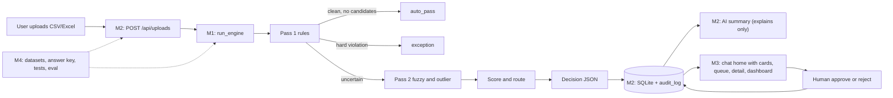

# 00 — SHARED CONTRACT (everyone reads this first)

Project: **Cache Me If You Can** — AP Exception Pile assistant (Microsoft Innovate 2026).
**v1.1 — chat-first.** The theme is *Smart Assistants & Chatbots*, so the **chatbot is the main interface** (home page). It handles the exception pile through chat plus inline exception cards. The engine stays as the trusted brain behind it. The chatbot can *propose* an approve/reject, but only a human clicking the confirm button changes anything. Problem-statement checklist: rules (limits, required fields, duplicates) · short report (CSV download) · auto-pass clean rows, send only low-confidence/exception rows to a human · each flag cites the matched record · audit log of every decision.
This file is the single source of truth. If your code and this file disagree, **this file wins**. Changes to it go through a PR approved by all 4 members.

## 0. One-paragraph summary
A web app. User uploads an invoice CSV/Excel. A deterministic **rules engine** (Member 1) decides each invoice: `auto_pass`, `needs_review` or `exception`, with a 0–1 confidence score and evidence. A **FastAPI backend** (Member 2) stores everything in SQLite, keeps an audit log, asks an LLM to *explain* flagged invoices, and runs a chat assistant that only reads verified DB data. A **React frontend** (Member 3) opens on a chat home that answers with inline invoice cards (with Approve and Reject buttons), plus review queue, invoice detail, dashboard and audit log pages. Member 4 owns data, tests, docs, demo. **The LLM never makes the financial decision.**

## 1. Roles
| Member | Role | Owns folder |
|---|---|---|
| M1 | Decision engine | `engine/` |
| M2 | Backend, DB, audit, AI, chat | `backend/` |
| M3 | Frontend + design system | `frontend/` |
| M4 | Data, QA, docs, demo, repo scaffolding | `data/ scripts/ tests/ docs/` + root files |

## 2. Repository layout (monorepo, branch from this exact skeleton)
```
cache-me-if-you-can/
├── README.md                    [M4]
├── requirements.txt             [M4] (only 3 lines: -r engine/requirements.txt, -r backend/requirements.txt, -r tests/requirements.txt)
├── pytest.ini                   [M4]
├── .gitignore  .gitattributes  .python-version   [M4, written once in Phase 0]
├── .github/pull_request_template.md              [M4]
├── contracts/                   [SHARED: change only by PR with all 4 approvals]
│   ├── labels.json
│   └── examples/                (engine_output.json, upload_response.json, invoice_list.json,
│                                 invoice_detail.json, stats.json, audit.json, chat.json (with cards and a proposal), config.json, report_sample.csv)
├── engine/                      [M1]  Python package `engine`
├── backend/                     [M2]  Python package `backend`
├── frontend/                    [M3]  React + Vite
├── data/                        [M4]  raw/  reference/  processed/
├── scripts/                     [M4]
├── tests/                       [M4]
└── docs/                        [M4]  (team_guides/ holds these 5 files)
```
**Rule: you may only edit files inside your own folder.** Need something changed elsewhere? Open a GitHub Issue tagged with the owner. Never "just fix it".

## 3. Git workflow and conflict prevention
Branches: `main` (final, protected) ← `develop` (integration) ← `m1/engine`, `m2/backend`, `m3/frontend`, `m4/data-qa` (one long-lived branch each; feature sub-branches optional, e.g. `m1/engine-fuzzy`).
- Daily start: `git fetch origin && git rebase origin/develop` (or merge if rebasing scares you). Daily end: push your branch.
- Merge your branch into `develop` by **PR** at every gate (section 11). The consumer of your interface reviews it (M1→M2, M2→M3, M3→M4, M4→M1).
- Commit format: `feat(engine): add fuzzy duplicate` / `fix(backend): ...` / `docs: ...` / `test: ...`. Scope = engine | backend | frontend | data | docs | contracts.
- Never force-push to `develop`/`main`. Never commit: `.env`, `*.db`, `node_modules/`, `.venv/`, `dist/`, `backend/storage/`, `__pycache__/`.

### Conflicts found in advance and how they are prevented
| # | Risk | Prevention |
|---|---|---|
| 1 | Two people edit one `requirements.txt` | One file per package: `engine/`, `backend/`, `tests/`. Root `requirements.txt` only has `-r` lines (M4, never edited again) |
| 2 | `package-lock.json` merge hell | Only M3 has Node files. Nobody else runs `npm` in the repo |
| 3 | `.gitignore` edited by many | M4 writes the full file in Phase 0 (content in `04_MEMBER4`). Need a new pattern? Ask M4 |
| 4 | Python import errors (`ModuleNotFoundError`) | Both `engine/` and `backend/` have `__init__.py`; **always run from repo root**: `uvicorn backend.main:app`, `pytest`. Never use `sys.path` hacks or `../` imports |
| 5 | Enum/label drift (`needs_review` vs `review`) | Only values in section 5 are legal. `contracts/labels.json` is the source |
| 6 | Field-name drift (camelCase vs snake_case) | **snake_case everywhere** in JSON, DB and Python. Frontend uses the keys as they arrive |
| 7 | Mock data ≠ real API shape | `contracts/examples/*.json` are the truth. M3 mocks copy them. M4 test `tests/contract/` validates examples against backend schemas |
| 8 | Windows/Mac line endings | `.gitattributes`: `* text=auto eol=lf` |
| 9 | DB file committed / different local DBs | `backend/data/app.db` gitignored; `python -m backend.seed` rebuilds demo data |
| 10 | Port clashes / CORS | Backend `8000`, frontend `5173`. Vite proxy forwards `/api` → `http://localhost:8000`. Frontend calls `/api/...` (relative) |
| 11 | Vendor list and categories differ between data and engine | Vendor master is `data/reference/vendor_master.csv` (M4). Engine reads it via config path. Categories fixed in section 5 |
| 12 | Different Python/Node versions | Python **3.11**, Node **20**. `.python-version` (M4), `.nvmrc` (M3) |
| 13 | Case-insensitive file systems | Python files lowercase_snake. React components `PascalCase.jsx`. Never two files differing only by case |
| 14 | Test discovery fights | `pytest.ini` (M4): `testpaths = engine/tests backend/tests tests`. Each owner tests in their own folder |
| 15 | Secrets leaked | Only `.env.example` is committed. Real keys stay local |
| 16 | LLM keys missing on someone's laptop | `AI_MODE=mock` is the default; everything works offline |
| 17 | Uploading same file twice flags everything as duplicate | `use_history` upload option defaults to `false` |
| 18 | Different date/number formats | Dates `YYYY-MM-DD`, timestamps ISO-8601 UTC, money = JSON number, default currency `INR` |
| 19 | Chat card shape drift between backend and UI | Card and Proposal shapes are fixed in section 8. M2 builds cards in Python, M3 renders by `type`, and the `chat.json` example holds one of each. The contract test checks it |
| 20 | Report opened in Excel runs formulas from cell text | M2 prefixes text cells that start with `=`, `+`, `-` or `@` with `'` in the CSV. Numeric columns are untouched |

## 4. Environment and commands (from repo root)
```
python -m venv .venv
# Mac/Linux: source .venv/bin/activate     Windows: .venv\Scripts\activate
pip install -r requirements.txt
uvicorn backend.main:app --reload --port 8000        # API docs at http://localhost:8000/docs
cd frontend && npm install && npm run dev             # http://localhost:5173
pytest                                                # all tests
python -m backend.seed                                # load demo data into DB
```
Env (`backend/.env`, copy from `backend/.env.example`): `AI_MODE=mock|azure`, `AZURE_OPENAI_ENDPOINT`, `AZURE_OPENAI_API_KEY`, `AZURE_OPENAI_DEPLOYMENT`, `AZURE_OPENAI_API_VERSION`, `DB_PATH=backend/data/app.db`, `MAX_UPLOAD_MB=10`.
Frontend env (`frontend/.env`): `VITE_USE_MOCK=true|false`.

## 5. Canonical data model and enums
**Canonical invoice fields** (the only names used across engine, DB, API, UI):
`invoice_id` (unique internal record ID, e.g. `INV-1042`), `invoice_number` (the vendor's own number; duplicates may share it), `vendor_name`, `invoice_date`, `due_date`, `currency`, `subtotal`, `tax_amount`, `total_amount`, `category`, `po_number`, `description`.
Required: `invoice_number, vendor_name, invoice_date, total_amount`. Others optional.

**Categories (exact strings):** `Office Supplies`, `IT Equipment`, `Software & Licenses`, `Travel`, `Utilities`, `Professional Services`, `Marketing`, `Logistics`, `Maintenance`, `Raw Materials`.

**Enums (exact strings only):**
- `decision`: `auto_pass` | `needs_review` | `exception`
- `exception_type`: `none` | `missing_field` | `invalid_amount` | `invalid_date` | `future_date` | `calculation_mismatch` | `exact_duplicate` | `fuzzy_duplicate` | `policy_limit` | `unknown_vendor` | `amount_outlier`
- `review_status`: `not_required` (auto_pass) | `pending` | `approved` | `rejected`
- `severity`: `hard` | `soft`
- `suggested_action`: `approve` | `reject` | `investigate` | `contact_vendor`
- `ai_summary_status`: `ready` | `not_generated` | `failed`
- `actor_type`: `engine` | `ai` | `user` | `system`
- `event_type`: `UPLOAD_RECEIVED` `INGESTION_COMPLETED` `INVOICE_AUTO_PASSED` `INVOICE_FLAGGED` `AI_SUMMARY_GENERATED` `REVIEW_APPROVED` `REVIEW_REJECTED` `SETTINGS_CHANGED` `CHAT_QUERY`

**`contracts/labels.json`** (M4 creates exactly this in Phase 0):
```json
{
 "decision": {"auto_pass":"Auto-passed","needs_review":"Needs review","exception":"Exception"},
 "exception_type": {"none":"No issue","missing_field":"Missing field","invalid_amount":"Invalid amount",
   "invalid_date":"Invalid date","future_date":"Future-dated","calculation_mismatch":"Calculation mismatch",
   "exact_duplicate":"Exact duplicate","fuzzy_duplicate":"Probable duplicate","policy_limit":"Over policy limit",
   "unknown_vendor":"Unknown vendor/category","amount_outlier":"Unusual amount"},
 "review_status": {"not_required":"Not required","pending":"Pending","approved":"Approved","rejected":"Rejected"},
 "suggested_action": {"approve":"Approve","reject":"Reject","investigate":"Investigate","contact_vendor":"Contact vendor"},
 "event_type": {"UPLOAD_RECEIVED":"File uploaded","INGESTION_COMPLETED":"File processed","INVOICE_AUTO_PASSED":"Auto-passed",
   "INVOICE_FLAGGED":"Sent for review","AI_SUMMARY_GENERATED":"AI summary created","REVIEW_APPROVED":"Approved by reviewer",
   "REVIEW_REJECTED":"Rejected by reviewer","SETTINGS_CHANGED":"Settings changed","CHAT_QUERY":"Assistant question"}
}
```

## 6. Decision engine contract (M1 produces, M2 consumes)
**Entry point:** `from engine import run_engine`
```python
run_engine(source, history=None, config=None) -> dict
# source: str|Path to .csv/.xlsx  OR  pandas.DataFrame
# history: optional list[dict] of canonical invoices from earlier uploads (default None = batch only)
# config: optional dict that overrides engine/config/default_config.json (deep-merged)
# raises engine.errors.IngestionError(message, details:list[str]) for file-level problems
```
**Output:**
```json
{
 "summary": {"total":1000,"auto_pass":816,"needs_review":90,"exception":94,
             "engine_version":"1.0.0","auto_pass_threshold":0.85,"exception_below":0.40},
 "warnings": [],
 "results": [
  {
   "invoice_id":"INV-1042", "row_index":42,
   "decision":"needs_review", "confidence":0.50, "pass_resolved_in":2,
   "exception_type":"fuzzy_duplicate",
   "primary_reason":"Probable duplicate of INV-0987 (96% similar)",
   "matched_record":"INV-0987",
   "violations":[
     {"rule_id":"R09","name":"Fuzzy duplicate","severity":"soft","penalty":0.35,
      "exception_type":"fuzzy_duplicate","message":"Probable duplicate of INV-0987 (96% similar)",
      "matched_record":"INV-0987",
      "evidence":{"vendor_similarity":0.94,"invoice_number_similarity":1.0,"amount_difference_pct":0.2,
                  "days_apart":1,"combined_similarity":0.96}},
     {"rule_id":"R10","name":"Near-identical amount","severity":"soft","penalty":0.15,
      "exception_type":"fuzzy_duplicate","message":"Amount within 0.2% of matched record INV-0987",
      "matched_record":"INV-0987","evidence":{"amount_difference_pct":0.2}}
   ],
   "evidence":{"matched_invoice_id":"INV-0987"},
   "record":{"invoice_id":"INV-1042","invoice_number":"AC/2026/0345","vendor_name":"Acme Pvt Ltd",
             "invoice_date":"2026-09-03","due_date":null,"currency":"INR","subtotal":8474.58,"tax_amount":1525.42,
             "total_amount":10000.0,"category":"Office Supplies","po_number":null,"description":null}
  }
 ]
}
```
Rules: `exception_type` = type of the violation with the highest penalty (tie → lowest rule number); `none` if no violations. `confidence` is rounded to 2 decimals. `primary_reason` = message of that violation, or `"No issues found"`.
The similarity numbers in this example (0.94, 0.96) are illustrative. With name normalisation the real engine gives a higher vendor similarity for this pair (about 0.98 combined). M4 regenerates `contracts/examples/*.json` from real engine output at Gate G2 so demo text matches what the app shows.

### Rule catalogue (IDs are final)
| ID | exception_type | Severity | Penalty | Fires when | Pass |
|---|---|---|---|---|---|
| R01 | missing_field | hard | 0.50 | any required field empty | 1 |
| R02 | invalid_amount | hard | 0.60 | total_amount not numeric or ≤ 0 | 1 |
| R03 | invalid_date | hard | 0.40 | invoice_date unparseable | 1 |
| R04 | future_date | soft | 0.30 | invoice_date > as_of_date | 1 |
| R05 | calculation_mismatch | soft | 0.35 | subtotal+tax differs from total by >0.5% (only if both present) | 1 |
| R06 | exact_duplicate | hard | 0.80 | same (vendor, invoice_number, total) as an earlier invoice | 1 |
| R07 | policy_limit | soft | 0.20 | total_amount > policy_limit | 1 |
| R08 | unknown_vendor | soft | 0.20 | vendor not in vendor master, or category not allowed | 1 |
| R09 | fuzzy_duplicate | soft | 0.35 (sim ≥0.85) / 0.20 (0.70–0.85) | similar to an earlier invoice (gate: invoice_number similarity ≥0.80) | 2 |
| R10 | fuzzy_duplicate | soft | 0.15 | R09 fired and amount within 1% of matched | 2 |
| R11 | amount_outlier | soft | 0.20 | z-score of total vs vendor history > 3 (needs ≥5 history) | 2 |

**Score and routing:** `confidence = max(0, 1 − Σ penalties)`.
Any hard violation → `exception`. Else `confidence ≥ auto_pass_threshold (0.85)` → `auto_pass`; `exception_below (0.40) ≤ confidence < 0.85` → `needs_review`; `< 0.40` → `exception`.
With default weights every single soft rule drops the score below 0.85, so lowering the threshold is what lets mild cases auto-pass (this is what threshold tuning shows).

**Default config** (`engine/config/default_config.json`, M1 owns, shape fixed):
```json
{
 "as_of_date": null, "auto_pass_threshold": 0.85, "exception_below": 0.40,
 "policy_limit": 100000, "calc_tolerance_pct": 0.5, "currency_default": "INR",
 "required_fields": ["invoice_number","vendor_name","invoice_date","total_amount"],
 "allowed_categories": ["Office Supplies","IT Equipment","Software & Licenses","Travel","Utilities",
   "Professional Services","Marketing","Logistics","Maintenance","Raw Materials"],
 "vendor_master_path": "data/reference/vendor_master.csv",
 "blocking": {"days": 30, "amount_pct": 10},
 "fuzzy": {"weights":{"vendor":0.35,"invoice_number":0.30,"amount":0.20,"date":0.15},
           "invoice_number_gate":0.80,"strong":0.85,"weak":0.70,"date_window_days":7,"near_amount_pct":1.0},
 "outlier": {"min_history":5,"z_threshold":3.0},
 "rules": {
  "R01":{"enabled":true,"penalty":0.50},"R02":{"enabled":true,"penalty":0.60},"R03":{"enabled":true,"penalty":0.40},
  "R04":{"enabled":true,"penalty":0.30},"R05":{"enabled":true,"penalty":0.35},"R06":{"enabled":true,"penalty":0.80},
  "R07":{"enabled":true,"penalty":0.20},"R08":{"enabled":true,"penalty":0.20},
  "R09":{"enabled":true,"penalty":0.35,"penalty_weak":0.20},"R10":{"enabled":true,"penalty":0.15},
  "R11":{"enabled":true,"penalty":0.20}}
}
```
`as_of_date: null` means "today". Tests set it to a fixed date.

## 7. Database schema (M2 owns `backend/schema.sql`; shape fixed)
```sql
CREATE TABLE uploads(id INTEGER PRIMARY KEY AUTOINCREMENT, filename TEXT NOT NULL, uploaded_at TEXT NOT NULL,
  uploaded_by TEXT, total_rows INTEGER, auto_pass_count INTEGER, needs_review_count INTEGER, exception_count INTEGER,
  used_history INTEGER DEFAULT 0);
CREATE TABLE invoices(id INTEGER PRIMARY KEY AUTOINCREMENT, upload_id INTEGER NOT NULL REFERENCES uploads(id),
  invoice_id TEXT NOT NULL, invoice_number TEXT, vendor_name TEXT, invoice_date TEXT, due_date TEXT,
  currency TEXT, subtotal REAL, tax_amount REAL, total_amount REAL, category TEXT, po_number TEXT, description TEXT,
  UNIQUE(upload_id, invoice_id));
CREATE TABLE decisions(id INTEGER PRIMARY KEY AUTOINCREMENT, invoice_pk INTEGER NOT NULL UNIQUE REFERENCES invoices(id),
  decision TEXT NOT NULL, confidence REAL NOT NULL, pass_resolved_in INTEGER, exception_type TEXT,
  primary_reason TEXT, matched_record TEXT, violations_json TEXT, evidence_json TEXT,
  ai_summary TEXT, ai_suggested_action TEXT, ai_summary_status TEXT DEFAULT 'not_generated',
  review_status TEXT NOT NULL DEFAULT 'pending', created_at TEXT NOT NULL);
CREATE TABLE reviews(id INTEGER PRIMARY KEY AUTOINCREMENT, decision_pk INTEGER NOT NULL REFERENCES decisions(id),
  reviewer TEXT NOT NULL, action TEXT NOT NULL, comment TEXT, reviewed_at TEXT NOT NULL);
CREATE TABLE audit_log(id INTEGER PRIMARY KEY AUTOINCREMENT, timestamp TEXT NOT NULL, actor TEXT NOT NULL,
  actor_type TEXT NOT NULL, event_type TEXT NOT NULL, invoice_id TEXT, upload_id INTEGER, details_json TEXT);
CREATE TABLE settings(key TEXT PRIMARY KEY, value TEXT NOT NULL);
CREATE INDEX idx_inv_upload ON invoices(upload_id); CREATE INDEX idx_dec_decision ON decisions(decision);
CREATE INDEX idx_audit_inv ON audit_log(invoice_id);
```

## 8. REST API contract (M2 implements, M3 consumes). Prefix `/api`, JSON, snake_case
Errors: HTTP 4xx/5xx with `{"error":{"code":"VALIDATION_ERROR|NOT_FOUND|CONFLICT|INTERNAL","message":"...","details":[...]}}`.
Pagination: `page` (1-based, default 1), `page_size` (default 25, max 200) → response `{items, total, page, page_size}`.

| Method + path | Purpose | Request | Response |
|---|---|---|---|
| GET `/api/health` | liveness | – | `{"status":"ok","ai_mode":"mock"}` |
| POST `/api/uploads` | upload + process | multipart: `file` (.csv/.xlsx ≤10MB), `uploaded_by` (opt), `use_history` (opt, default false) | 201 `{upload_id, filename, summary:{total,auto_pass,needs_review,exception}, warnings:[]}` · 422 on unreadable file / missing required columns |
| GET `/api/uploads` | list | – | `{items:[{id,filename,uploaded_at,uploaded_by,total_rows,auto_pass_count,needs_review_count,exception_count}]}` newest first |
| GET `/api/invoices` | list + filter | query: `upload_id, decision (comma list), exception_type, review_status, category, search, min_confidence, max_confidence, sort (confidence\|invoice_date\|total_amount\|vendor_name\|invoice_id), order (asc\|desc), page, page_size` | paginated `InvoiceListItem` |
| GET `/api/invoices/{id}` | detail (`id` = DB pk) | – | `InvoiceDetail` |
| POST `/api/invoices/{id}/summary` | create/refresh AI summary | – | `{ai_summary, ai_suggested_action, ai_summary_status}` |
| POST `/api/invoices/{id}/review` | approve/reject | `{"action":"approve\|reject","reviewer":"Name","comment":"opt"}` | updated `InvoiceDetail` · 409 if already reviewed or not reviewable |
| GET `/api/stats` | dashboard numbers | query `upload_id` (opt; omitted = all) | `Stats` |
| GET `/api/audit` | audit trail | query `upload_id, invoice_id, event_type, page, page_size` | paginated `AuditEvent`, newest first |
| POST `/api/chat` | assistant (home screen) | `{"message":"...","session_id":"opt","upload_id":null}` | `{reply, session_id, referenced_invoice_ids:[], tools_used:[{name,arguments}], cards:[Card], proposal: Proposal\|null}` |

| GET `/api/uploads/{upload_id}/report` | short report download | query `decision` (default `needs_review,exception`) | CSV attachment `ap_exception_report_<upload_id>.csv`, columns: `invoice_id, invoice_number, vendor_name, invoice_date, total_amount, currency, decision, confidence, exception_type, primary_reason, matched_record, review_status` |
| GET `/api/config` | thresholds + rules | – | `{auto_pass_threshold, exception_below, policy_limit, rules:[{rule_id,name,severity,penalty,enabled,exception_type}]}` |
| PUT `/api/config` | change thresholds | `{auto_pass_threshold?, exception_below?}` (0–1, exception_below < auto_pass) | same as GET; writes audit `SETTINGS_CHANGED`. Applies to **future** uploads |

**Chat `Card`** (UI renders inline, max 5 per reply): `{"type":"invoice","id":7,"invoice_id":"INV-1042","vendor_name":"Acme Pvt Ltd","total_amount":10000.0,"currency":"INR","decision":"needs_review","confidence":0.5,"primary_reason":"Probable duplicate of INV-0987 (96% similar)","matched_record":"INV-0987","review_status":"pending"}` · or `{"type":"stats","upload_id":1,"total":1000,"auto_pass":816,"needs_review":90,"exception":94}` · or `{"type":"report","upload_id":1,"url":"/api/uploads/1/report"}`.
**`Proposal`** (chat never writes): `{"type":"review_proposal","id":7,"invoice_id":"INV-1042","action":"approve|reject","reason":"text"}`. The UI shows a confirm button; on click it calls the normal `POST /api/invoices/{id}/review` with the reviewer's name. Only that call changes data and creates the `REVIEW_*` audit event.
Cards are built from DB rows by the backend (never typed by the LLM), so card data is always verified.

**InvoiceListItem:** `id, upload_id, invoice_id, invoice_number, vendor_name, invoice_date, total_amount, currency, category, decision, confidence, exception_type, primary_reason, review_status`.
**InvoiceDetail:**
```json
{"invoice":{"id":7,"upload_id":1,"invoice_id":"INV-1042","invoice_number":"AC/2026/0345","vendor_name":"Acme Pvt Ltd",
  "invoice_date":"2026-09-03","due_date":null,"currency":"INR","subtotal":8474.58,"tax_amount":1525.42,
  "total_amount":10000.0,"category":"Office Supplies","po_number":null,"description":null},
 "decision":{"decision":"needs_review","confidence":0.5,"pass_resolved_in":2,"exception_type":"fuzzy_duplicate",
  "primary_reason":"Probable duplicate of INV-0987 (96% similar)","matched_record":"INV-0987",
  "violations":[ /* same objects as engine output */ ],"evidence":{"matched_invoice_id":"INV-0987"},
  "ai_summary":"…","ai_suggested_action":"investigate","ai_summary_status":"ready","review_status":"pending"},
 "matched_invoice": { /* same shape as "invoice", or null */ },
 "reviews":[{"id":1,"reviewer":"Shree","action":"approve","comment":"ok","reviewed_at":"2026-10-07T10:15:00Z"}]}
```
**Stats:** `{upload_id, total, by_decision:{auto_pass,needs_review,exception}, auto_pass_rate (0–1), pending_reviews, by_exception_type:[{exception_type,count}], confidence_histogram:[{bucket:"0.0-0.1",count}] (10 buckets), estimated_minutes_saved (auto_pass × 5, label it "estimate")}`.
**AuditEvent:** `{id,timestamp,actor,actor_type,event_type,invoice_id,upload_id,details}`.
Actor names: engine → `decision-engine`, AI → `ai-assistant`, users → reviewer name, system → `system`.
Review only allowed when `review_status = pending`. Summary is **not** generated inside GET (keeps GET fast); M3 calls `POST …/summary` when status is `not_generated`.

## 9. AI contracts (M2 implements, M4 tests)
- `backend.ai.summary.generate_summary(decision_record: dict) -> {"summary": str, "suggested_action": <enum>, "referenced_rule_ids": [str]}`. `decision_record` has the engine result shape. Summary ≤ 3 sentences / ≤ 600 chars, uses only facts present in the record, never invents invoice IDs.
- `backend.ai.tools.TOOL_REGISTRY: dict[str, callable]` with tools that **never write to the DB**: `get_invoice(invoice_id)`, `explain_decision(invoice_id)`, `list_pending(limit=5)` (lowest confidence first), `list_exceptions(exception_type=None, limit=10)`, `list_duplicates(limit=10)`, `get_stats(upload_id=None)`, `get_audit(invoice_id, limit=10)`, `get_report_link(upload_id=None)`, `propose_review(invoice_id, action)` (returns a `Proposal`, writes nothing). Each tool returns `{data, cards}` so the UI can show verified cards.
- `AI_MODE=mock` must return deterministic template output with the same schema (used by all tests and CI).

## 10. Design system (M3 builds it; M2/M4 follow wording; M4 uses the same colours in docs/deck)
**Tokens** (`frontend/src/styles/tokens.css` is the only place colours/sizes are defined):
```css
:root{
 --color-primary:#0078D4; --color-primary-hover:#106EBE; --color-primary-soft:#E5F1FB;
 --color-navy:#11213F; --color-navy-2:#1B2F55;
 --color-bg:#F4F7FB; --color-surface:#FFFFFF; --color-border:#D8E0EA;
 --color-text:#11213F; --color-text-muted:#5B6B7F; --color-on-dark:#FFFFFF;
 --color-pass:#107C10; --color-pass-bg:#E6F4E6;
 --color-review:#B35C00; --color-review-bg:#FFF1DB;
 --color-exception:#C42B31; --color-exception-bg:#FDE7E9;
 --font-sans:"Segoe UI",system-ui,-apple-system,Roboto,sans-serif; --font-mono:ui-monospace,Consolas,monospace;
 --fs-xs:12px; --fs-sm:14px; --fs-md:16px; --fs-lg:20px; --fs-xl:28px;
 --space-1:4px; --space-2:8px; --space-3:12px; --space-4:16px; --space-5:24px; --space-6:32px;
 --radius:8px; --shadow:0 1px 3px rgba(17,33,63,.08),0 4px 12px rgba(17,33,63,.06);
}
```
**Rules:** one font family; spacing only from the scale; no hex codes in components; decision colours are *only* pass=green, review=amber, exception=red (never reuse them for decoration); badges always show icon + text (not colour alone); max content width 1280px; sidebar 240px navy.
**Formatting:** money `new Intl.NumberFormat('en-IN',{style:'currency',currency})`; dates `DD MMM YYYY`; confidence shown as `0.50` with a bar coloured by the invoice's decision (a hard-rule exception can still score 0.50); IDs in mono font.
**Wording:** use the labels in section 5 everywhere (UI, AI text, docs, deck). Use "Needs review" and "Exception" as status labels, never "Pending exception" or a "Flagged" badge. The word "flagged" is fine inside chat sentences and user questions. Buttons: "Approve", "Reject". Empty states say what to do next ("Upload an invoice file to get started").
**Shared screens (M3):** **Assistant (home, route `/`)**, Review Queue `/queue`, Invoices `/invoices`, Invoice Detail `/invoices/:id`, Dashboard `/dashboard`, Audit Log `/audit`, Upload `/upload`, Settings `/settings`. Sidebar order: Assistant, Review Queue, Invoices, Dashboard, Audit Log, Upload, Settings. The chat's exception card looks identical everywhere an invoice summary appears (same Badge, ConfidenceBar, wording).

## 11. Gates, integration order and daily habits
| Gate | When | Must be true | Merge into `develop` |
|---|---|---|---|
| G0 Scaffold | Day 1 | M4 pushed skeleton + this file + `contracts/` + examples; all 4 cloned and ran hello-world | M4 |
| G1 Foundations | end Phase 1 | M1 ingestion + R01–R08 working on CSV; M2 upload → DB with a *stub engine result*; M3 shell, chat home and pages on mock; M4 datasets + answer key | M1, M2, M3, M4 |
| G2 Core | end Phase 2 | Real engine wired into upload; review + audit endpoints; queue/detail screens and chat home with cards (mock AI) on real API | M1 → M2 → M3 |
| G3 Intelligence | end Phase 3 | Pass 2, scoring, AI summary, chat, charts; eval report ≥ target | all |
| G4 Integration | Phase 4 | M3 `VITE_USE_MOCK=false`; M4 end-to-end test green; bug list closed | all |
| G5 Freeze | Phase 5 | No new features; demo rehearsed; `develop` → `main` | M4 |
Merge order inside every gate: **M4 → M1 → M2 → M3** (each builds on the previous). Run `pytest` on `develop` before merging to `main`. 15-minute standup daily: yesterday / today / blocked.
Targets for G3: recall ≥ 0.95 and precision ≥ 0.80 on the test dataset (flagged = decision ≠ auto_pass).

## 12. Overall workflow

