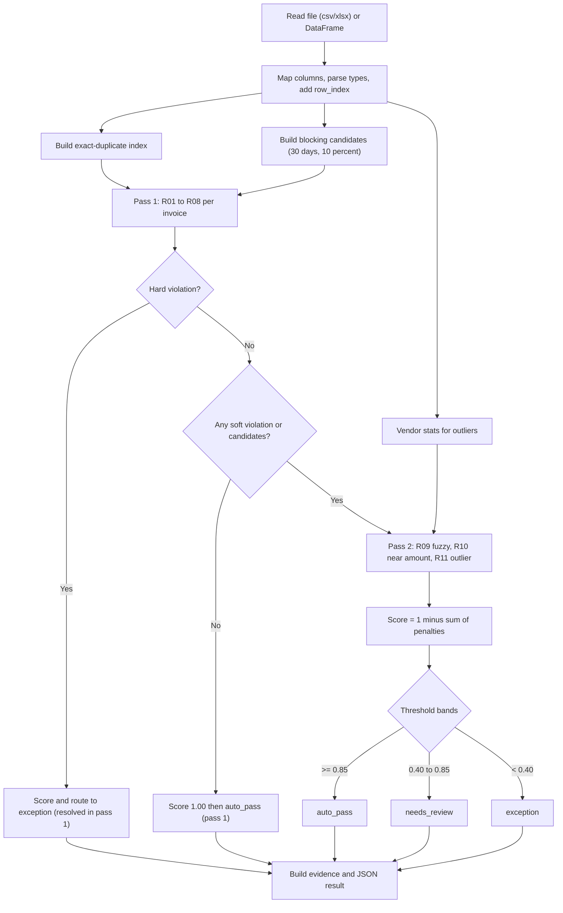

# 01 — MEMBER 1: DECISION ENGINE (Heavy)

**Read first:** `00_SHARED_CONTRACT.md`. Everything in section 5–6 of that file (enums, rule IDs, output JSON, config) is binding.
**You own:** `engine/` only. **Never edit:** `backend/`, `frontend/`, `data/`, `tests/`, `contracts/` (PR only).

## 0. Prompt to give an AI (copy-paste)
> You are building the Python package `engine/` for the project in `00_SHARED_CONTRACT.md` and `01_MEMBER1_DECISION_ENGINE.md` (both attached). Create exactly the files listed in section 2, in the build order of section 4. Follow the rule catalogue, config shape, output JSON and enums from the contract without renaming anything. Use only pandas, rapidfuzz, openpyxl. Write pytest tests in `engine/tests/` for every item in section 8. Do not touch any folder except `engine/`. At the end, run `pytest engine/tests` and fix failures.

## 1. Your job in one line
Take an invoice file and return, for each invoice, `auto_pass | needs_review | exception` + a 0–1 confidence + the rules broken + evidence. **Deterministic. No AI inside the engine.**

## 2. Folder tree (create exactly this)
```
engine/
├── __init__.py              # exports run_engine, load_config; __version__ = "1.0.0"
├── api.py                   # run_engine(source, history=None, config=None)
├── config_loader.py         # load_config(overrides) → dict (deep-merge over default)
├── config/default_config.json   # copy from contract section 6, unchanged
├── errors.py                # class IngestionError(Exception): message, details
├── schemas.py               # Violation dataclass, helpers to build result dicts
├── ingestion.py             # read file, map column aliases, canonicalise types
├── normalize.py             # normalize_vendor, normalize_invoice_number, parse_date, parse_amount
├── rules/
│   ├── __init__.py
│   ├── pass1.py             # R01–R08 as small functions
│   └── pass2.py             # R09–R11
├── duplicates.py            # exact key index, blocking, fuzzy similarity
├── stats.py                 # vendor mean/std for outliers
├── scoring.py               # compute_score(violations)
├── routing.py               # route(score, violations, cfg) → decision
├── evidence.py              # primary violation, primary_reason, evidence dict
├── requirements.txt         # pandas~=2.2, rapidfuzz~=3.9, openpyxl~=3.1
├── README.md                # how to call it, how to add a rule
└── tests/                   # test_ingestion.py test_pass1.py test_duplicates.py test_scoring.py test_api.py conftest.py
```
`engine/` must not import from `backend/`. Backend imports you, never the reverse.

## 3. Public interface (frozen)
```python
def run_engine(source, history=None, config=None) -> dict   # output = contract section 6
```
Same input + same config ⇒ identical output (no randomness, no clock except `as_of_date=None` → today).

## 4. Build order (do in this order; commit after each step)

### Step 1 — Config + errors
`load_config(overrides)`: read `default_config.json`, deep-merge `overrides`, return dict. Validate `0 ≤ exception_below < auto_pass_threshold ≤ 1`.

### Step 2 — normalize.py
- `normalize_vendor(s)`: lowercase → remove punctuation → drop tokens in `{pvt, private, ltd, limited, inc, llc, co, corp, corporation, the, and}` → collapse spaces.
- `normalize_invoice_number(s)`: uppercase, keep only `[A-Z0-9]`.
- `parse_amount(x)`: strip `₹,$` and commas; returns float or `None`.
- `parse_date(x)`: try `pd.to_datetime(x, dayfirst=True, errors="coerce")`; returns ISO `YYYY-MM-DD` or `None`.

### Step 3 — ingestion.py
1. Read `.csv` (`pd.read_csv(dtype=str)`) or `.xlsx` (`pd.read_excel(dtype=str)`); other extension → `IngestionError`.
2. Normalise header names: lowercase, non-alphanumerics → `_`. Map via `COLUMN_ALIASES`:
```python
COLUMN_ALIASES = {
 "invoice_id": ["invoice_id","record_id","id"],
 "invoice_number": ["invoice_number","invoice_no","inv_no","inv_number","bill_number","bill_no"],
 "vendor_name": ["vendor_name","vendor","supplier","supplier_name"],
 "invoice_date": ["invoice_date","date","bill_date"],
 "due_date": ["due_date","payment_due"],
 "currency": ["currency","curr"],
 "subtotal": ["subtotal","net_amount","amount_before_tax"],
 "tax_amount": ["tax_amount","tax","gst","vat"],
 "total_amount": ["total_amount","total","amount","grand_total"],
 "category": ["category","expense_category"],
 "po_number": ["po_number","po","purchase_order"],
 "description": ["description","details","memo"]}
```
3. If **none** of `invoice_number, vendor_name, invoice_date, total_amount` columns can be found → `IngestionError` listing the missing columns (file-level problem). Missing *values* are rule R01, not an error.
4. If `invoice_id` column missing → generate `ROW-0001`, `ROW-0002`… Add a warning. If duplicated `invoice_id` values → make unique by suffixing `-dupN` and add a warning.
5. Add `row_index` (1-based). Currency default from config. Parse amounts/dates **but keep raw values** in `raw_*` fields for evidence (e.g. `raw_total_amount`, `raw_invoice_date`).
6. Return `(records: list[dict], warnings: list[str])`.

### Step 4 — Pass 1 (rules/pass1.py)
Each rule: `def r01(rec, ctx) -> Violation | None`. `ctx` holds cfg, `as_of_date`, `vendor_master` (set of normalized vendor names, or empty), `exact_matches` dict.
| Rule | Logic | message template | evidence |
|---|---|---|---|
| R01 | list required fields that are null/empty | `Missing required field(s): {fields}` | `{"missing_fields":[...]}` |
| R02 | total is None or ≤ 0 | `Invalid amount: {raw}` | `{"raw_total_amount":…}` |
| R03 | invoice_date None | `Invalid invoice date: {raw}` | `{"raw_invoice_date":…}` |
| R04 | date > as_of_date | `Invoice date {date} is in the future` | `{"invoice_date","as_of_date"}` |
| R05 | both subtotal & tax present and `abs(subtotal+tax−total)/total*100 > 0.5` | `Total {total} does not equal subtotal + tax ({expected})` | `{"subtotal","tax_amount","total_amount","expected_total","difference"}` |
| R06 | `exact_matches[invoice_id]` exists | `Exact duplicate of {matched}` | `{"matched_invoice_id","key":{vendor,invoice_number,total}}` |
| R07 | total > policy_limit | `Amount {total} exceeds policy limit {limit}` | `{"total_amount","policy_limit"}` |
| R08 | vendor_master non-empty and vendor not in it, **or** category present and not in allowed_categories | `Vendor or category not in approved list` | `{"vendor_name","category","reason"}` |
Skip R04/R05/R07 when their inputs are invalid (avoid noise). If `vendor_master_path` file is missing, R08 only checks category (add a warning once).

### Step 5 — Exact duplicates (duplicates.py)
Key = `(normalize_vendor(vendor), normalize_invoice_number(invoice_number), round(total,2))`. Sort records by `(invoice_date, row_index)`; the **first** occurrence is the original (not flagged); each later one gets `exact_matches[its invoice_id] = original invoice_id`. Include `history` records in the index (history items are always "earlier").

### Step 6 — Blocking + candidates (duplicates.py)
For each record (no hard violation yet needed), candidate set = other records (batch + history) whose `invoice_date` is within ±`blocking.days` and `total_amount` within `blocking.amount_pct`%. Implementation: sort by date, sliding window; compare amounts inside the window. Only candidates dated **on or before** the record (by date then row_index) count as "earlier".

### Step 7 — Uncertain test + Pass 2 (rules/pass2.py)
`uncertain = (no hard violation) and (len(pass1 violations) > 0 or len(candidates) > 0)`.
For uncertain records:
- **R09 fuzzy duplicate**, for each candidate compute
  - `vendor_sim = rapidfuzz.fuzz.token_set_ratio(nv_a, nv_b)/100`
  - `inv_sim = rapidfuzz.fuzz.ratio(ninv_a, ninv_b)/100`
  - `amount_sim = 1 − abs(a−b)/max(a,b)`
  - `date_sim = 1 − min(days_apart, 7)/7`
  - `combined = 0.35*vendor + 0.30*inv + 0.20*amount + 0.15*date`
  - **Gate:** only if `inv_sim ≥ 0.80`. Take the best candidate. `combined ≥ 0.85` → penalty 0.35; `0.70 ≤ combined < 0.85` → penalty 0.20. Skip if the best candidate is already the exact-duplicate match.
  - message `Probable duplicate of {matched} ({combined:.0%} similar)`; evidence keys as in contract example.
- **R10**: R09 fired and `amount_difference_pct ≤ 1.0` → penalty 0.15, message `Amount within {pct:.1f}% of matched record {matched}`.
- **R11 outlier**: vendor stats from all batch+history totals of that vendor *excluding this invoice*; need ≥ 5 values and std > 0; `z = (total−mean)/std`; fire if `z > 3`. Message `Amount is {z:.1f} standard deviations from this vendor's usual`.
`pass_resolved_in = 2` if the record entered Pass 2 (even if nothing fired), else `1`.

### Step 8 — scoring.py, routing.py, evidence.py
```python
score = round(max(0.0, 1.0 - sum(v.penalty for v in violations)), 2)
def route(score, violations, cfg):
    if any(v.severity == "hard" for v in violations): return "exception"
    if score >= cfg["auto_pass_threshold"]: return "auto_pass"
    if score >= cfg["exception_below"]: return "needs_review"
    return "exception"
```
`evidence.py`: primary violation = highest penalty (tie → lowest rule number). `exception_type`, `primary_reason`, `matched_record` come from it (matched_record = first non-null among violations). Top-level `evidence` = `{"matched_invoice_id": …}` or `{}`.
Penalties come from `cfg["rules"][rule_id]["penalty"]`; skip rules with `enabled=false`.

### Step 9 — api.py
Orchestrates: ingest → exact index → candidates → vendor stats → loop records → build results (sorted by `row_index`) → summary counts. Include `record` (canonical fields only, no `raw_*`). Never mutate `history`.

## 5. Worked example (must be a test)
INV-0987 `Acme Private Limited`, number `AC/2026/0345`, 10,020, 2026-09-02. INV-1042 `Acme Pvt Ltd`, same number, 10,000, 2026-09-03.
Pass 1 clean, candidate found ⇒ uncertain. vendor_sim ≈ 1.0 after normalisation (the guide's 0.94 is illustrative), inv_sim 1.0, amount_sim 0.998, date_sim 0.857 ⇒ combined ≈ 0.98 ≥ 0.85 → R09 0.35; amount diff 0.2% → R10 0.15. The real message reads "98% similar" (the contract example numbers are illustrative). Score 0.50 → `needs_review`, `exception_type=fuzzy_duplicate`, `matched_record=INV-0987`, `pass_resolved_in=2`.

## 6. Workflow diagram


## 7. What you hand to others
- To **M2** (Gate G1): working `run_engine` for R01–R08 + `engine/README.md` with 1 example call. Until then M2 uses `contracts/examples/engine_output.json`.
- To **M4**: tell them the `config` override keys they can use for threshold sweeps (`auto_pass_threshold`, `exception_below`, `rules.Rxx.penalty`, `as_of_date`).
- Fixed `as_of_date` for tests: `"2026-10-01"`.

## 8. Tests you write (`engine/tests/`)
1. Missing vendor → R01, decision `exception`, confidence ≤ 0.50.
2. total `-5` / `0` / `"abc"` → R02 exception.
3. `"31/31/2026"` → R03.
4. Date after as_of_date → R04, `needs_review`, confidence 0.70.
5. subtotal 100 + tax 18 vs total 150 → R05; total 118 → no R05.
6. Exact duplicate pair → second flagged R06 `exception`, first not flagged.
7. Fuzzy example from section 5 → `needs_review`, 0.50.
8. Same vendor, nearby date, similar amount but **different** invoice number → NOT flagged (gate works).
9. Total 150000 → R07, 0.80, `needs_review`.
10. Vendor with 30 normal invoices + one 10× larger → R11.
11. Clean invoice with no candidates → `auto_pass`, 1.00, `pass_resolved_in=1`.
12. Threshold override 0.75 makes a 0.80 invoice `auto_pass`.
13. Column aliases (`Inv No.`, `Supplier`, `Amount`) ingest correctly.
14. Missing all required columns → `IngestionError`.
15. Deterministic: two runs → equal output.
16. 5,000-row synthetic frame runs in < 10 s.
17. Output validates against the contract shape (keys, enums).

## 9. Conflict watch
- Don't rename any key/enum/rule ID. If you think the contract is wrong, open an Issue; don't silently change it.
- `default_config.json` shape is frozen; adding a key is allowed only via contract PR.
- Don't read files outside `engine/` except `data/reference/vendor_master.csv` (path from config, relative to repo root; run from root).

## 10. Definition of done
- [ ] `run_engine` returns the exact contract shape; all 17 tests pass (`pytest engine/tests`)
- [ ] M4's `tests/engine_cases` and eval on `data/processed/invoices_train.csv` run without errors
- [ ] `engine/README.md` explains each rule, the config and how to add a rule
- [ ] You can explain on one page: two passes, rule weights, score formula, threshold choice, fuzzy gate (use the guide HTML + this file)
