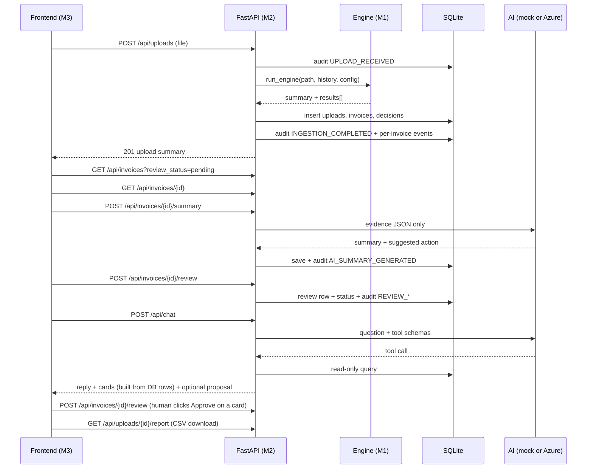

# 02 — MEMBER 2: BACKEND, DATABASE, AUDIT, AI AND CHAT (Heavy)

**Read first:** `00_SHARED_CONTRACT.md` (sections 4, 7, 8, 9 are your spec).
**You own:** `backend/` only. **Never edit:** `engine/`, `frontend/`, `data/`, `tests/`, `contracts/` (PR only).

## 0. Prompt to give an AI (copy-paste)
> Build the FastAPI package `backend/` described in `00_SHARED_CONTRACT.md` and `02_MEMBER2_BACKEND_AI.md`. Create exactly the files in section 2 in the build order of section 4. Endpoints, JSON keys, enums, SQL schema and error format must match the contract character for character. Import the engine with `from engine import run_engine` (do not edit `engine/`). AI must default to `AI_MODE=mock` with deterministic output; add Azure OpenAI as the optional live mode. Write tests in `backend/tests/` using FastAPI TestClient and a temporary SQLite file. Do not touch any folder except `backend/`.

## 1. Your job in one line
Store results, expose the API, log every event, let AI **explain** flagged invoices, and run a chat assistant that can only read verified DB data. **The AI never changes a decision.**

## 2. Folder tree
```
backend/
├── __init__.py
├── main.py                 # FastAPI app, CORS (localhost:5173), error handlers, include routers, init DB on startup
├── settings.py             # env loading (AI_MODE, DB_PATH, MAX_UPLOAD_MB, Azure vars)
├── database.py             # get_conn(), init_db() runs schema.sql, helpers (row→dict)
├── schema.sql              # copy from contract section 7, unchanged
├── schemas.py              # Pydantic models for every request/response in contract section 8
├── errors.py               # ApiError(code, message, details, status) + handler → {"error": {...}}
├── routers/
│   ├── __init__.py
│   ├── health.py  uploads.py  invoices.py  reviews.py  stats.py  audit.py  chat.py  report.py  config_api.py
├── services/
│   ├── __init__.py
│   ├── upload_service.py   # file save → engine → DB → audit
│   ├── invoice_service.py  # list/filter/detail queries
│   ├── review_service.py   # approve/reject rules
│   ├── audit_service.py    # log_event(...), query
│   ├── stats_service.py
│   ├── report_service.py   # CSV report (contract section 8 columns), formula-safe
│   ├── config_service.py   # thresholds in settings table
│   └── chat_service.py     # chat loop
├── ai/
│   ├── __init__.py
│   ├── summary.py          # generate_summary(decision_record) — CONTRACT FUNCTION
│   ├── tools.py            # TOOL_REGISTRY + JSON schemas — CONTRACT OBJECT
│   ├── prompts.py          # SYSTEM_SUMMARY, SYSTEM_CHAT
│   ├── llm_client.py       # AzureOpenAI wrapper (only used if AI_MODE=azure)
│   ├── mock_llm.py         # deterministic template summary + regex chat intents
│   ├── validate.py         # validate_summary(output, record)
│   └── cards.py            # invoice/stats/report cards and proposals built from DB rows (no LLM)
├── seed.py                 # python -m backend.seed → loads data/processed/invoices_demo.csv through upload_service
├── storage/uploads/.gitkeep    # uploaded files (contents gitignored)
├── data/.gitkeep               # app.db lives here (gitignored)
├── requirements.txt        # fastapi~=0.115 uvicorn[standard]~=0.30 pydantic~=2.8 python-multipart~=0.0.9 openai~=1.40 python-dotenv~=1.0 httpx~=0.27
├── .env.example
├── README.md
└── tests/                  # conftest.py test_upload.py test_invoices.py test_review.py test_audit.py test_stats.py test_chat.py test_cards.py test_report.py test_ai.py test_config.py
```

## 3. Build order

### Step 1 — Skeleton (Gate G0/G1)
`main.py` with `/api/health`, CORS, error handler, DB init. Run `uvicorn backend.main:app --reload`. Commit and tell M3 the base URL works.
**Stub engine:** if `engine` import fails or isn't ready, `upload_service` loads `contracts/examples/engine_output.json` so M3 isn't blocked. Remove the stub once M1 delivers (keep a `USE_ENGINE_STUB=true` env flag for emergencies).

### Step 2 — Database + audit service
`log_event(actor, actor_type, event_type, invoice_id=None, upload_id=None, details=None)` inserts into `audit_log` with UTC ISO timestamp. **Every state change must call it.** Use one transaction per upload and bulk `executemany` (1,000 rows in < 3 s).

### Step 3 — Upload pipeline (`POST /api/uploads`)
```
1. Validate extension (.csv/.xlsx) and size ≤ MAX_UPLOAD_MB → else 422 VALIDATION_ERROR
2. Save to backend/storage/uploads/<uuid>_<safe_filename>
3. audit UPLOAD_RECEIVED
4. history = canonical invoices from DB if use_history else None
5. result = run_engine(path, history=history, config={auto_pass_threshold, exception_below from settings table})
   (IngestionError → 422 with details; nothing written to DB)
6. insert uploads row, invoices rows, decisions rows
     review_status = "not_required" if decision == auto_pass else "pending"
     store violations_json / evidence_json with json.dumps
7. audit INGESTION_COMPLETED (details = summary)
8. audit per invoice: INVOICE_AUTO_PASSED or INVOICE_FLAGGED (actor decision-engine, actor_type engine,
   details = {decision, confidence, exception_type, primary_reason})
9. return 201 {upload_id, filename, summary, warnings}
```
Do **not** generate AI summaries here (slow). M3 calls `POST /api/invoices/{id}/summary` on demand.

### Step 4 — Read endpoints
- `GET /api/invoices`: SQL with filters from contract; `decision` accepts comma list; `search` uses `LIKE` on invoice_id, invoice_number, vendor_name; whitelist `sort` columns (no string-built SQL from user input — use a dict mapping); default sort `confidence asc` if `review_status` filter present else `invoice_id asc`.
- `GET /api/invoices/{id}`: join invoice + decision; parse JSON columns; `matched_invoice` = invoice in same upload whose `invoice_id == matched_record` (or null); include reviews.
- `GET /api/uploads`, `GET /api/stats`, `GET /api/audit` per contract. Histogram buckets `"0.0-0.1" … "0.9-1.0"` (1.0 goes in the last bucket). `estimated_minutes_saved = auto_pass * 5`.

### Step 5 — Review endpoint
`POST /api/invoices/{id}/review`: validate action; `reviewer` required non-empty; decision must have `review_status == pending` else 409 CONFLICT. Insert `reviews` row, set `review_status` to `approved`/`rejected`, audit `REVIEW_APPROVED`/`REVIEW_REJECTED` (actor = reviewer, actor_type user, details = comment + previous confidence). Return updated InvoiceDetail.

### Step 6 — Config endpoints
Thresholds stored in `settings` table (`auto_pass_threshold`, `exception_below`), defaults from engine config. `GET /api/config` also returns `rules` list built from `engine.config_loader.load_config()` (names from the rule catalogue in the contract). `PUT` validates `0 ≤ exception_below < auto_pass_threshold ≤ 1`, audits `SETTINGS_CHANGED`. Applies to future uploads only.

### Step 7 — AI summary (`ai/summary.py`)
```python
def generate_summary(decision_record: dict) -> dict:
    # returns {"summary": str, "suggested_action": enum, "referenced_rule_ids": [..]}
```
- `AI_MODE=mock`: template from `primary_reason` + violation messages. Suggested action: `exception_type` in (exact_duplicate, fuzzy_duplicate) → `investigate`; missing/invalid fields → `contact_vendor`; policy_limit/amount_outlier → `investigate`; calculation_mismatch → `contact_vendor`; future_date → `contact_vendor`; unknown_vendor → `investigate`; `auto_pass` → `approve`.
- `AI_MODE=azure`: call Azure OpenAI chat completions with `response_format={"type":"json_object"}`, `temperature=0`, `max_tokens=300`, using this system prompt (`prompts.py`):
```
You help accounts-payable reviewers understand why an invoice was flagged.
Use ONLY the facts in the JSON you are given. Never invent invoice IDs, vendors, amounts, dates or rules.
You do not decide payment; you only explain and suggest.
Reply with strict JSON: {"summary": string (max 3 sentences, plain English),
"suggested_action": one of "approve","reject","investigate","contact_vendor",
"referenced_rule_ids": [rule ids you relied on]}.
```
- `validate.py`: JSON parses; keys present; action in enum; `len(summary) ≤ 600`; ≤ 3 sentences; every token matching `[A-Z]{2,5}-\d{2,}` in the summary must appear in the record (`invoice_id`, `matched_record`); every `referenced_rule_ids` must be in the record's violations. On failure retry once, then fall back to the mock template and set `ai_summary_status="failed"` only if even the fallback errors.
- Endpoint `POST /api/invoices/{id}/summary` builds `decision_record` from DB, calls `generate_summary`, saves `ai_summary`, `ai_suggested_action`, `ai_summary_status="ready"`, audits `AI_SUMMARY_GENERATED` (actor `ai-assistant`, actor_type `ai`). Idempotent: return stored value unless the record has no summary yet.

### Step 8 — Chat assistant
`ai/tools.py` — read-only functions that query the DB and return small JSON dicts (never raw SQL from the model):
`get_invoice(invoice_id)`, `explain_decision(invoice_id)`, `list_exceptions(exception_type=None, limit=10)`, `list_duplicates(limit=10)`, `get_stats(upload_id=None)`, `get_audit(invoice_id, limit=10)`. Each has an OpenAI-style JSON schema. If an invoice ID is not found return `{"error":"not_found"}`.
Chat loop (`chat_service.py`): max 4 tool-call rounds; system prompt:
```
You are the AP exception assistant. Answer ONLY from tool results. If a tool returns nothing, say you could not find it.
Never invent invoice IDs or numbers. Never approve, reject or change anything. Keep answers under 120 words.
```
Collect `referenced_invoice_ids` = invoice IDs appearing in tool results that are also in the reply. Audit `CHAT_QUERY` (actor `ai-assistant`, details = message + tools used). `session_id` = uuid if not given; keep last 6 messages in memory per session.
`mock_llm.py` chat intents (regex, case-insensitive): `why .* (INV-\d+|[A-Z]{2,5}-\d+)` → explain_decision; `duplicate` → list_duplicates; `how many|stats|summary|rate` → get_stats; `exception|flag` → list_exceptions; `audit|history` + id → get_audit; else a help message listing example questions. Replies are built from the tool results by templates.

### Step 8b — Chat-first additions (v1.1)
1. **Tools return `{data, cards}`.** Build cards in Python from DB rows (contract §8 `Card`), never from LLM text. `chat_service` collects cards from all tool results (max 5, de-duplicated by invoice) and returns them in `cards`.
2. New tools: `list_pending(limit=5)` (sort confidence asc, `review_status=pending`), `get_report_link(upload_id=None)` (card type `report`), `propose_review(invoice_id, action)`. `propose_review` validates the invoice is `pending`, then returns a `Proposal`; it must **not** write to the DB. The chat reply says e.g. "I suggest approving INV-1042; please confirm with the button." `chat_service` returns it as `proposal`.
3. Mock intents to add: `show|list|riskiest|pending|queue` → list_pending; `report|download|export` → get_report_link; `approve|reject` + invoice id → propose_review; `latest|summary of (my )?upload` → get_stats.
4. System prompt addition: "You may suggest an approve/reject with propose_review, but you can never execute it. The human confirms with a button."
5. **Report endpoint** `GET /api/uploads/{upload_id}/report` returns a `StreamingResponse` CSV (`Content-Disposition: attachment; filename=ap_exception_report_<upload_id>.csv`). Use UTF-8 with a BOM so Excel shows the rupee sign correctly. Always write the header row. Columns exactly as contract section 8. Default filter `decision=needs_review,exception`, sorted by confidence ascending, then invoice_id. **Spreadsheet-safe:** prefix text cells (vendor_name, invoice_number, primary_reason, matched_record) that start with `=`, `+`, `-` or `@` with a single quote. Do not touch numeric columns. Downloads are read-only, so no audit event is written.
6. Tests to add: "Show me the riskiest ones" returns ≤5 cards sorted by confidence asc; "Approve INV-1042" returns a proposal and the DB row is **unchanged** and no `REVIEW_*` audit exists; unknown ID → no card, "could not find"; report CSV has the right header and only flagged rows; every card's data equals the DB row; a vendor named `=HYPERLINK(...)` is prefixed with `'` in the CSV; chat never returns more than 5 cards.

### Step 9 — seed + tests + README
`seed.py` uploads the demo CSV so M3/M4 can demo without clicking. Tests (section 7). README: run commands, env vars, curl examples for each endpoint.

## 4. Sequence diagram


## 5. Hand-offs
- **To M3 (G1):** running API + `/docs` (Swagger) and the exact payloads in `contracts/examples/`. If a payload differs from the contract, fix your code, not the examples.
- **To M4:** `generate_summary`, `TOOL_REGISTRY`, a `/api/health` that shows `ai_mode`, and `python -m backend.seed`.
- **From M1:** `run_engine`. Until ready, stub.

## 6. Conflict watch
- All paths relative to repo root; run from root. Never hard-code `C:\…`.
- Do not edit the engine config; read thresholds from the settings table and pass them as `config` overrides.
- Response keys must be **snake_case exactly as in the contract**; use Pydantic models with `response_model` so FastAPI enforces it.
- Don't commit `backend/data/app.db`, uploaded files or `.env`.

## 7. Tests (`backend/tests/`)
1. Upload valid CSV → 201, counts add up, DB rows = rows in file.
2. Upload `.txt` or empty file → 422 with the error format.
3. Upload CSV missing required columns → 422, nothing in DB.
4. List filters: `decision=needs_review,exception`, `search=INV-1042`, `min/max_confidence`, sort asc/desc, pagination.
5. Detail returns `matched_invoice` for a fuzzy duplicate.
6. Review: approve → status approved + audit row; second review → 409; empty reviewer → 422.
7. Auto-passed invoice cannot be reviewed (409).
8. Every upload/flag/review/AI/chat/settings action creates the right audit event.
9. Stats: numbers equal direct DB counts; histogram sums to total.
10. Summary (mock): schema valid, no unknown IDs; `validate_summary` rejects a summary containing `INV-9999`.
11. Chat (mock): "Why was INV-1042 flagged?" uses `explain_decision`; unknown ID → "could not find"; reply never contains IDs absent from tool results.
12. Config: invalid thresholds → 422; valid change audited and used by next upload.
13. Response shapes validate against `contracts/examples/*.json` keys.
14. Chat cards, proposals and the report: see the test list in Step 8b item 6.

## 8. Definition of done
- [ ] All endpoints in contract section 8 work and appear in `/docs`
- [ ] `pytest backend/tests` green with `AI_MODE=mock` and no internet
- [ ] `python -m backend.seed` produces a populated demo DB
- [ ] Azure mode works when env vars are set (manual check), mock mode is default
- [ ] Chat returns cards built from DB rows; `propose_review` never writes (DB unchanged, no REVIEW_* audit)
- [ ] Report CSV downloads, opens in Excel with the rupee sign intact, and is formula-safe
- [ ] 1,000-row upload completes in under 5 s (mock AI)
- [ ] You can explain: why AI doesn't decide, how chat is grounded (fixed tools), what the audit log records
