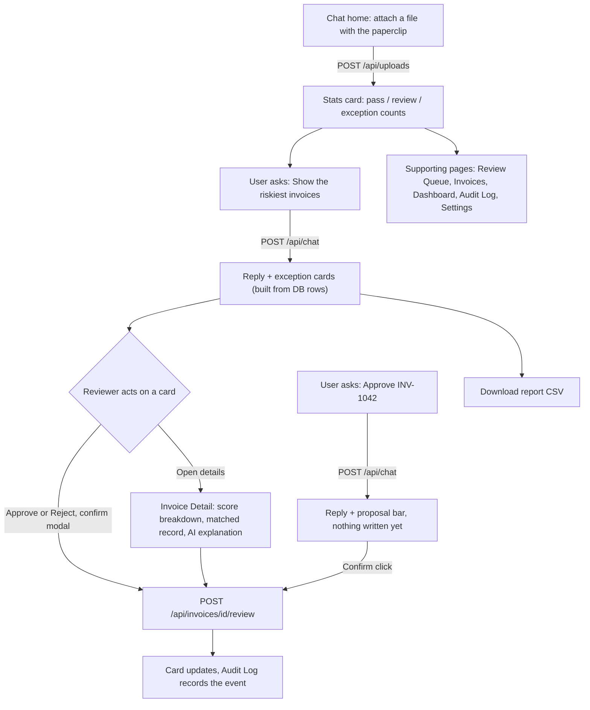

# 03 — MEMBER 3: FRONTEND AND DESIGN SYSTEM (Light–Medium)

**Read first:** `00_SHARED_CONTRACT.md` (sections 5, 8, 10 are your spec; the design tokens are binding).
**You own:** `frontend/` only. **Never edit:** `engine/`, `backend/`, `data/`, `tests/`, `contracts/` (PR only).
You are also the **guardian of UI consistency**: M2's wording and M4's docs/slides follow your tokens and labels.

## 0. Prompt to give an AI (copy-paste)
> Build the React + Vite app in `frontend/` described in `00_SHARED_CONTRACT.md` and `03_MEMBER3_FRONTEND.md`. Create the files in section 2. Use plain CSS with the tokens from contract section 10 (no hex codes outside `tokens.css`), React 18, react-router-dom 6, Recharts. All data access goes through `src/lib/api.js`, which switches to `src/mocks/mockApi.js` when `VITE_USE_MOCK=true`. Use only the enum values and labels from the contract. Build each page in section 4 with loading, empty and error states. Section 4b defines the Assistant, which is the home page. Do not touch folders other than `frontend/`.

## 1. Your job in one line
Turn the API into a clear, consistent, enterprise-looking interface where a reviewer can understand any flagged invoice in seconds.

## 2. Folder tree
```
frontend/
├── index.html
├── package.json            # react ^18.3, react-dom, react-router-dom ^6, recharts ^2.12, vite ^5, @vitejs/plugin-react
├── vite.config.js          # server.port 5173; proxy "/api" → http://localhost:8000
├── .nvmrc                  # 20
├── .env.example            # VITE_USE_MOCK=true
├── README.md
├── scripts/sync-mocks.mjs  # copies ../contracts/examples/*.json → src/mocks/ and report_sample.csv → public/mock_report.csv
└── src/
    ├── main.jsx  App.jsx  routes.jsx
    ├── styles/   tokens.css (contract §10 verbatim)  global.css  components.css
    ├── lib/      api.js  labels.js  format.js  constants.js
    ├── mocks/    mockApi.js  + synced *.json
    ├── hooks/    useApi.js  useReviewer.js
    ├── components/
    │   ├── layout/   AppShell.jsx Sidebar.jsx Topbar.jsx
    │   ├── ui/       Button.jsx Badge.jsx Card.jsx StatTile.jsx DataTable.jsx FilterBar.jsx
    │   │             ConfidenceBar.jsx EmptyState.jsx ErrorState.jsx Spinner.jsx Toast.jsx Pagination.jsx
    │   ├── invoice/  InvoiceFields.jsx MatchedCompare.jsx ViolationsList.jsx ScoreBreakdown.jsx
    │   │             AiSummaryCard.jsx ReviewActions.jsx ReviewHistory.jsx
    │   ├── charts/   DecisionDonut.jsx ExceptionsByTypeBar.jsx ConfidenceHistogram.jsx
    │   └── chat/     ChatPanel.jsx ChatMessage.jsx ChatComposer.jsx SuggestedPrompts.jsx SummaryStrip.jsx CardRenderer.jsx
    │                 ExceptionCard.jsx ProposalConfirm.jsx AttachButton.jsx
    └── pages/  Dashboard.jsx Upload.jsx Invoices.jsx ReviewQueue.jsx InvoiceDetail.jsx AuditLog.jsx Assistant.jsx Settings.jsx
```

## 3. Foundations (build first, Gate G1)
1. **tokens.css**: paste the contract block unchanged. `global.css` sets `body{font-family:var(--font-sans);background:var(--color-bg);color:var(--color-text)}`.
2. **labels.js**: export the label maps from contract §5 (`DECISION_LABEL`, `EXCEPTION_LABEL`, `REVIEW_STATUS_LABEL`, `ACTION_LABEL`, `EVENT_LABEL`). Never write a label string inside a component.
3. **format.js**: `formatMoney(n, currency)` (`en-IN`), `formatDate('2026-09-03')` → `03 Sep 2026`, `formatConfidence(0.5)` → `0.50`, `formatDateTime`.
4. **api.js** (one function per endpoint; all return parsed JSON or throw `{code,message,details}`):
`getUploads, uploadFile(file, {uploadedBy, useHistory}), getInvoices(params), getInvoice(id), createSummary(id), reviewInvoice(id,{action,reviewer,comment}), getStats(uploadId), getAudit(params), sendChat(message, sessionId), getConfig(), putConfig(body), reportUrl(uploadId, decision)`. `sendChat` accepts an optional `uploadId` and returns `{reply, session_id, referenced_invoice_ids, tools_used, cards, proposal}`. `reportUrl` returns a string: `/api/uploads/{id}/report?...`, or `/mock_report.csv` in mock mode.
`VITE_USE_MOCK=true` → re-export the same names from `mockApi.js` which reads synced JSON (fake delay 300 ms; filters can be naive). Real mode uses relative `/api/...` via `fetch`.
5. **useReviewer**: reviewer name input in the Topbar stored in `localStorage` (try/catch). Review buttons stay disabled until a name exists.
6. **AppShell**: sidebar 240px navy (`--color-navy`), links in this order (v1.1): Assistant (home `/`), Review Queue, Invoices, Dashboard, Audit Log, Upload, Settings. Active link = `--color-primary` left border. Topbar: page title, reviewer name field, badge showing current `auto_pass_threshold`.

## 4. Pages (what each shows and which endpoint feeds it)
| Page / route | Endpoint(s) | Content |
|---|---|---|
| **Dashboard** `/dashboard` | `getUploads`, `getStats(latestUploadId)`, `getConfig` | 4 StatTiles: Total, Auto-pass rate, Needs review, Exceptions; plus Pending reviews and "Estimated time saved (estimate)". Charts: DecisionDonut (green/amber/red), ExceptionsByTypeBar (labels from `EXCEPTION_LABEL`), ConfidenceHistogram with a vertical `ReferenceLine` at `auto_pass_threshold`. Upload selector (dropdown of uploads) |
| **Upload** `/upload` | `uploadFile` | Drag-and-drop zone (.csv/.xlsx, 10 MB), checkbox "Also compare with earlier uploads" (default off), progress spinner, result card with 3 counts and button "Go to Review Queue". Show 422 `details` as a list |
| **Invoices** `/invoices` | `getInvoices` | FilterBar: search, decision multiselect, exception type, review status, category, confidence range; DataTable (Invoice ID mono, Vendor, Date, Amount, Decision badge, ConfidenceBar, Type, Review status), sortable columns, Pagination 25/page; row click → `/invoices/:id` |
| **Review Queue** `/queue` | `getInvoices({review_status:'pending', decision:'needs_review,exception', sort:'confidence', order:'asc'})` | Same table, tabs by exception type with counts, header "Lowest confidence first", row click → detail |
| **Invoice Detail** `/invoices/:id` | `getInvoice`, `createSummary` (auto-call on mount if `ai_summary_status==='not_generated'`) | Header: invoice_id, decision Badge, ConfidenceBar. Left: InvoiceFields. Right: MatchedCompare (two columns, differing fields highlighted with `--color-review-bg`). **ScoreBreakdown** ("report card": `1.00` then each violation `−0.35 Probable duplicate` … `= 0.50`). ViolationsList with rule id, message, evidence key/values. AiSummaryCard (summary + suggested action chip, label "AI explanation — does not decide"). ReviewActions (Approve / Reject + comment; confirm modal) and ReviewHistory. If `review_status` isn't `pending` actions are hidden |
| **Audit Log** `/audit` | `getAudit` | Filters: event type, invoice ID; table Time, Actor (with actor_type icon), Event (`EVENT_LABEL`), Invoice (link), Details (expandable JSON) |
| **Assistant (home)** `/` | `sendChat` | Chat panel, suggested prompts ("Why was INV-1042 flagged?", "Show all duplicates", "How many exceptions are pending?"), referenced invoice IDs rendered as links to the detail page (need lookup by `invoice_id`: call `getInvoices({search:id})` and take first), typing indicator, error bubble |
| **Settings** `/settings` | `getConfig`, `putConfig` | Two number inputs (auto-pass threshold, exception-below) with validation, note "applies to future uploads", read-only rules table (ID, name, severity, penalty) |

### 4b. Chat-first home (v1.1; the Assistant is the home page and Dashboard moves to `/dashboard`)
- **Routes:** Assistant is `/` (home); Dashboard moves to `/dashboard`. Sidebar order: Assistant, Review Queue, Invoices, Dashboard, Audit Log, Upload, Settings.
- **Home layout:** slim summary strip on top (latest upload counts from `getStats`: Auto-passed, Needs review, Exceptions, Pending), chat below filling the page. Suggested prompt chips: "Show the riskiest invoices", "Why was INV-1042 flagged?", "Show all duplicates", "Download the report", "What happened to INV-1042?".
- **Attach button (paperclip)** in the input: calls `uploadFile`, then inserts an assistant message built from the upload `summary` (a stats card) and a prompt chip "Show the riskiest ones".
- **Render `cards` from `/api/chat`:** `invoice` → `ExceptionCard` (invoice_id mono, vendor, amount, decision Badge, ConfidenceBar, primary_reason, "Matched: INV-0987" link, buttons **Open details**, **Approve**, **Reject** — Approve/Reject open the same confirm modal as the detail page and call `reviewInvoice`); `stats` → `StatTile` row; `report` → "Download report (CSV)" button linking to `url`.
- **`proposal`:** show a `ProposalConfirm` bar under the reply: "Assistant suggests: Approve INV-1042 — [Confirm approve] [Dismiss]". Confirm calls `reviewInvoice` with the reviewer name. Nothing happens without the click. After success, append "Done. Logged in the audit trail." and refresh the card.
- Reviewer name required before Confirm/Approve/Reject (inline hint if empty).
- Pages Review Queue/Invoices also get a **Download report** button (link built with `reportUrl(uploadId)`).
- New components: `components/chat/ExceptionCard.jsx`, `components/chat/ProposalConfirm.jsx`, `components/chat/AttachButton.jsx`. `ExceptionCard` reuses `Badge`, `ConfidenceBar`, formatters — no new colours.
- Mock mode: `mockApi.sendChat` returns the synced `chat.json` (which includes `cards` and a `proposal`).

Every page must have: **loading** (Spinner), **empty** (EmptyState with next action) and **error** (ErrorState with Retry) states.

## 5. Component rules (consistency checklist)
- `Badge` variants map 1:1: `auto_pass`→green+✔, `needs_review`→amber+⚠, `exception`→red+✖; review statuses use neutral grey/blue chips. Text always present.
- `ConfidenceBar`: 0–1 bar coloured by the invoice's **decision** (auto_pass green, needs_review amber, exception red), with tick marks at the two thresholds from `/api/config`, plus the numeric value. Never colour by the number alone: a hard-rule exception can still score 0.50.
- `DataTable`: sticky header, zebra off, 44px rows, hover `--color-primary-soft`, keyboard focusable rows.
- Buttons: Primary (blue), Secondary (outline), Danger (red, only for Reject). Min height 36px. Visible focus ring.
- Cards: white, `--radius`, `--shadow`, 16–24px padding. Section titles 20px semibold. Page title 28px.
- Responsive: ≥ 1024px full layout; below, sidebar collapses to icons; tables scroll horizontally.
- Accessibility: labels on inputs, `aria-label` on icon buttons, contrast ≥ 4.5:1, never colour-only status.
- Charts: Recharts only; decision colours fixed (green/amber/red); other series use `--color-primary` shades; every chart has a title and an accessible text summary.

## 6. Workflow diagram (user journey in your screens, chat-first)


## 7. Build order
1. **G0/G1:** Vite app, tokens, AppShell, labels/format, `api.js` + mock mode, **chat home on mock data** (message list, composer, SummaryStrip, ExceptionCard, stats row from `StatTile`), upload through the paperclip, Invoices page.
2. **G2:** `CardRenderer` for every card type, `ProposalConfirm`, Review Queue, Invoice Detail (all subcomponents), Audit Log, Download report buttons.
3. **G3:** Dashboard charts, Settings, loading/empty/error states, chat polish (typing indicator, error bubble).
4. **G4:** set `VITE_USE_MOCK=false`, test against real API, fix shape mismatches (report API bugs to M2 via Issues, not by reshaping data in the UI).
5. **G5:** polish, screenshots for M4 (1440×900 PNGs into `frontend/screenshots/`), freeze.

## 8. Hand-offs
- **From M4 (G0):** `contracts/examples/*.json` → run `npm run sync:mocks`.
- **From M2:** API at `localhost:8000` and Swagger `/docs`.
- **To M4:** screenshots, a short `frontend/README.md` (run, build, env), list of routes.

## 9. Conflict watch
- Only you run `npm install`; commit `package-lock.json` once and only change it when you add a dependency (announce in chat).
- No hex colours or font names outside `tokens.css`; no inline `style` colours.
- Do not reshape API data to fit the UI: if a field is missing, raise an Issue for M2.
- `src/mocks/*.json` are generated copies; never hand-edit them (edit the contract examples via PR).
- Component files are `PascalCase.jsx`; no file names differing only by case.

## 10. Definition of done
- [ ] All 8 pages work on mock data **and** on the real API
- [ ] Chat is the home page; every card type renders; Approve/Reject from a card uses the confirm modal; a proposal changes nothing until Confirm is clicked
- [ ] Download report works (real API and mock file)
- [ ] Same visual language everywhere (tokens only), all labels come from `labels.js`
- [ ] Loading / empty / error states on every page; keyboard navigation works
- [ ] Detail page shows ScoreBreakdown, matched record comparison, AI card, review actions
- [ ] Threshold line visible on the histogram; threshold badge in Topbar
- [ ] `npm run build` succeeds with no errors; screenshots delivered to M4
