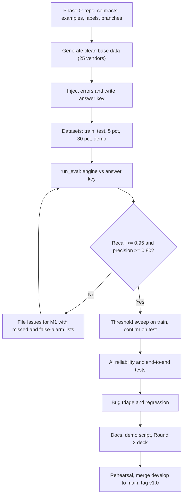

# 04 — MEMBER 4: DATA, QA, DOCS, DEMO AND REPO SETUP (Light, but you start the project)

**Read first:** `00_SHARED_CONTRACT.md` (all of it; you enforce it).
**You own:** root files, `data/`, `scripts/`, `tests/`, `docs/`, `.github/`. **Never edit:** `engine/`, `backend/`, `frontend/`, `contracts/` content (you scaffold it in Phase 0, then changes need a PR with all approvals).
You have the most spare capacity: if M1/M2/M3 fall behind, you pick up simple tasks they hand you (an Issue per task).

## 0. Prompt to give an AI (copy-paste)
> Using `00_SHARED_CONTRACT.md` and `04_MEMBER4_DATA_QA_DOCS.md`, create the repository skeleton (Phase 0), the dataset generator and answer keys, the evaluation and threshold-sweep scripts, the test suites, and the docs listed in section 2. Do not touch `engine/`, `backend/` or `frontend/` source. Use Python 3.11, pandas, Faker, pytest, matplotlib. All outputs must follow the canonical fields, enums and categories in the contract exactly.

## 1. Phase 0 — you start the project (Day 1, ~1 hour)
```
mkdir cache-me-if-you-can && cd cache-me-if-you-can && git init -b main
```
Create (empty folders get a `.gitkeep`):
```
contracts/examples/   engine/ (with __init__.py and engine/tests/.gitkeep)   backend/ (with __init__.py)
frontend/   data/raw/  data/reference/  data/processed/   scripts/   tests/   docs/team_guides/   .github/
```
Files to write:
1. `docs/team_guides/` ← copy the 5 guide files.
2. `contracts/CONTRACT.md` ← copy of `00_SHARED_CONTRACT.md`; `contracts/labels.json` from contract §5.
3. `contracts/examples/*.json` ← from the payloads in contract §6 and §8 (engine_output, upload_response, invoice_list with 5 rows across all 3 decisions, invoice_detail (the INV-1042 example), stats, audit (6 events), chat (a reply with one card of each type `invoice`, `stats`, `report`, plus one `proposal`), config) and `report_sample.csv` (header plus 5 rows in the contract section 8 columns). Realistic and **internally consistent** (same IDs everywhere). M3 and M2 depend on these.
4. `requirements.txt`:
```
-r engine/requirements.txt
-r backend/requirements.txt
-r tests/requirements.txt
```
5. `tests/requirements.txt`: `pytest~=8.2`, `httpx~=0.27`, `faker~=26.0`, `matplotlib~=3.9`, `jsonschema~=4.22`.
6. `pytest.ini`: `[pytest]` / `testpaths = engine/tests backend/tests tests` / `markers = live: needs Azure keys`.
7. `.python-version`: `3.11`. `.gitattributes`: `* text=auto eol=lf`.
8. `.gitignore`:
```
__pycache__/
*.pyc
.venv/
venv/
.env
*.db
backend/storage/uploads/*
!backend/storage/uploads/.gitkeep
backend/data/*
!backend/data/.gitkeep
node_modules/
dist/
.vite/
.pytest_cache/
.DS_Store
.idea/
.vscode/
*.log
docs/reports/tmp/
```
9. `.github/pull_request_template.md`: sections *What changed / Which contract parts touched / How tested / Screenshots / Checklist (tests pass, no edits outside my folder, no secrets)*.
10. `README.md`: project summary, run commands (contract §4), team and ownership table, link to docs.
11. Push `main`, create `develop` and the four member branches, enable branch protection on `main` (PR required), invite the team. **Gate G0:** each member clones, creates their venv/node setup, and confirms hello-world.

## 2. Folder tree you own
```
data/
├── raw/                        # downloaded generator output + SROIE sample; NEVER edited (add README.md with source/date)
├── reference/vendor_master.csv # columns: vendor_name, normalized_name ; 25 vendors (engine reads this)
└── processed/
    ├── invoices_train.csv      + answer_key_train.csv    (seed 42, 1000 rows, 18.4% bad)
    ├── invoices_test.csv       + answer_key_test.csv     (seed 99, 1000 rows, 18.4% bad) — never used for tuning
    ├── invoices_low_5pct.csv   + answer_key_low_5pct.csv (seed 7, 5%)
    ├── invoices_high_30pct.csv + answer_key_high_30pct.csv (seed 11, 30%)
    └── invoices_demo.csv       + answer_key_demo.csv     (seed 2026, 18.4%, with planted showcase records)
scripts/
├── generate_dataset.py         # --n --error-rate --seed --out --plant-demo
├── inject_errors.py            # error injection functions (imported by generator)
├── run_eval.py                 # engine vs answer key → metrics JSON/MD
├── tune_threshold.py           # sweep thresholds → CSV + PNG
└── validate_contracts.py       # optional CLI wrapper of the contract test
tests/
├── conftest.py                 # fixtures: fixed as_of_date "2026-10-01", temp DB client
├── engine_cases/cases.csv + test_rule_cases.py
├── contract/test_examples_match_schemas.py
├── integration/test_end_to_end.py
├── ai/ai_cases.json + test_ai_reliability.py
└── requirements.txt
docs/
├── ARCHITECTURE.md  SETUP.md  API.md  TEST_PLAN.md  EVAL_REPORT.md  DEMO_SCRIPT.md  QA_PREP.md  BUG_LOG.md
├── team_guides/ (5 files)  diagrams/  reports/  deck/ (Round 2 slide notes + screenshots list)
```

## 3. Dataset plan
**Source:** use the *Synthetic Accounting Data Generator* from your slides for the realistic base into `data/raw/` if it fits; otherwise `generate_dataset.py` builds clean data with Faker. Either way the **processed CSVs must use the canonical columns** (contract §5): `invoice_id, invoice_number, vendor_name, invoice_date, due_date, currency, subtotal, tax_amount, total_amount, category, po_number, description`.
**Clean data rules (so the engine isn't unfairly flagged):**
- 25 fixed vendors from `vendor_master.csv`; each has a typical amount range (log-normal) between 500 and 90,000 INR; categories only from the contract list.
- Unique `invoice_id` (`INV-0001`…), unique `invoice_number` per vendor (e.g. `AC/2026/0001`), `tax_amount = 18% of subtotal`, `total = subtotal + tax` rounded to 2 decimals.
- Dates between 2025-10-01 and 2026-09-25 (all before `as_of_date` 2026-10-01).
**Injected errors for n=1000 at 18.4% (184 bad); scale proportionally for other rates:**
| Type (`expected_exception_type`) | Count | How to corrupt a *copy or clean row* |
|---|---|---|
| exact_duplicate | 40 | copy an earlier row, new `invoice_id`, same vendor/number/total (date may be +0–5 days) |
| fuzzy_duplicate | 30 | copy an earlier row, new `invoice_id`, same `invoice_number`, vendor name variant (`Pvt Ltd`↔`Private Limited`, caps/punctuation), total ±0.1–1%, date ±1–3 days |
| missing_field | 30 | blank one of vendor_name / invoice_number / invoice_date / total_amount |
| invalid_amount | 12 | total = 0, negative or text |
| invalid_date | 5 | `"31/31/2026"`, `"not a date"` |
| future_date | 10 | date after 2026-10-01 |
| calculation_mismatch | 25 | total ≠ subtotal+tax by 2–20% |
| policy_limit | 15 | total 110,000–400,000 (keep subtotal+tax consistent) |
| unknown_vendor | 10 | vendor not in master, or category not in the list |
| amount_outlier | 7 | total = 8–12× that vendor's mean (keep below 100,000 so only R11 fires; use a vendor with ≥ 15 invoices) |
Rows get shuffled by date. **Each injected row must break only its own rule** (avoid accidental double faults).
**Answer key** (`answer_key_*.csv`): `invoice_id, is_bad (0/1), expected_exception_type (enum or none), matched_record (original's invoice_id or empty), note`. Only the *copy* of a duplicate is bad; the original is clean.
**Demo dataset extras (`--plant-demo`):** plant `INV-0987` (Acme Private Limited, `AC/2026/0345`, 10,020, 2026-09-02) and `INV-1042` (Acme Pvt Ltd, same number, 10,000, 2026-09-03) as the fuzzy-duplicate showcase; one exact duplicate, one missing-field, one future-dated, one policy-limit invoice with memorable IDs listed in `DEMO_SCRIPT.md`.
Deliver `invoices_train.csv` + `vendor_master.csv` + examples **by Gate G1**; all other datasets by G2.

## 4. Scripts
- `run_eval.py --data invoices_test.csv --key answer_key_test.csv [--config '{"auto_pass_threshold":0.85}']`
  - flagged = `decision != auto_pass`; compute TP/FP/FN/TN, precision, recall, F1, per-type recall, **type accuracy** (for correctly flagged bad rows: engine `exception_type == expected`), list of missed (FN) and false-alarm (FP) IDs. Writes `docs/reports/eval_<dataset>.json` and `.md`.
- `tune_threshold.py`: sweep thresholds `[0.70,0.75,0.80,0.85,0.90,0.95]` on **train**, then report the chosen value on **test**. Output table (threshold, missed errors, false alarms, precision, recall) + `docs/reports/threshold_sweep.png`. Also run on the 5% and 30% datasets to show stability.
- Targets (contract §11): recall ≥ 0.95, precision ≥ 0.80 on test. If missed, file Issues for M1 with the FN list.

## 5. Tests
1. **Rule cases** `tests/engine_cases/cases.csv` (columns: case_id, input fields…, expected_decision, expected_exception_type, expected_confidence) — at least 30 rows covering every rule R01–R11 at least twice plus clean passes and boundary values (0.5% calc tolerance, 100,000 limit, fuzzy 0.85/0.70 edges). `test_rule_cases.py` runs them through `run_engine` with fixed `as_of_date`.
2. **Contract test:** load every `contracts/examples/*.json`, assert required keys and enum membership (using `labels.json` and the contract lists); assert backend Pydantic models accept them.
3. **End-to-end** (`tests/integration/test_end_to_end.py`, TestClient, mock AI): upload demo CSV → counts match eval expectation → fetch queue → open INV-1042 (matched INV-0987) → create summary → approve → audit contains UPLOAD_RECEIVED, INVOICE_FLAGGED, AI_SUMMARY_GENERATED, REVIEW_APPROVED in order → chat "Why was INV-1042 flagged?" mentions INV-0987.
4. **AI reliability** (`tests/ai/`): 20 decision records from real engine output (all exception types). For each: output schema valid; `suggested_action` in enum; ≤ 3 sentences; no invoice ID absent from the record; every currency amount in the summary exists in the record; mentions `matched_record` if present; same input twice → same action (mock) ; a **prompt-regression** file `ai_cases.json` stores expected action per case. Chat tests: 10 questions → expected tool called, `referenced_invoice_ids ⊆ DB IDs`, unknown ID → "could not find". Tests marked `@pytest.mark.live` run only with `AI_MODE=azure` (manual, before demo).
5. **Robustness:** empty file, wrong extension, 10MB+ file, duplicate IDs in file, 5,000-row performance.
6. **Chat-first checks:** (a) "Show the riskiest invoices" returns at most 5 `invoice` cards sorted by confidence ascending; (b) "Approve INV-1042" returns a `proposal` and leaves the DB row and audit log unchanged; (c) the report CSV has the contract header and only flagged rows; (d) a vendor named `=HYPERLINK("x")` appears as `'=HYPERLINK("x")` in the CSV; (e) `chat.json` validates against the Card and Proposal shapes in contract section 8.

## 6. Docs you write (keep wording identical to labels in contract §5)
- `SETUP.md` (Windows + Mac, 10 steps, troubleshooting), `ARCHITECTURE.md` (the contract §12 diagram, layers, why rules decide and AI explains), `API.md` (table from contract §8 + curl examples), `TEST_PLAN.md`, `EVAL_REPORT.md` (metrics, threshold sweep table, honest limits: synthetic data, overfitting, how re-tuning works), `BUG_LOG.md` (ID, found by, owner, severity, status), `QA_PREP.md` (teacher/judge Q&A from our earlier discussion: who decides flags, why two passes, threshold choice, existing tools comparison, limits including reviewer names that are typed, not authenticated).
- **Existing-tools comparison** must stay accurate: Dynamics 365 Finance (Copilot chat, confidence on OCR fields), SAP Concur Invoice (Joule), SAP Business ByDesign (fixed exception types, tolerances). We differ by explaining each flag with evidence, a score breakdown on the *decision*, an evidence-grounded chat, and AI that never decides.
- Slide typos to fix in the Round 2 deck: "Audit Trial"→"Audit Trail", "SAP Courier Invoice"→"SAP Concur Invoice", "Rechart"→"Recharts". Deck uses the contract §10 colours and font.

## 7. Demo script (3–4 minutes, chat-first) — `DEMO_SCRIPT.md`
1. (20 s) Problem: about 18% of invoices become exceptions and people dig through them by hand.
2. (30 s) Open the Assistant home page. Click the paperclip and attach `invoices_demo.csv` (1,000 invoices). A stats card shows about 816 auto-passed and about 184 needing attention.
3. (30 s) Type "Show the riskiest invoices". Exception cards appear, lowest confidence first.
4. (40 s) Type "Why was INV-1042 flagged?". The reply cites matched record INV-0987 and the card shows both.
5. (30 s) Open details: score breakdown (1.00 → 0.50), side-by-side comparison, AI explanation with suggested action.
6. (20 s) Type "Approve INV-1042". The assistant only proposes. Click Confirm. It answers "Done. Logged in the audit trail."
7. (15 s) Type "Download the report". A CSV downloads.
8. (20 s) Audit Log shows every step. Dashboard with the threshold line is the backup screen.
9. (15 s) Close: "Rules decide, AI explains, humans confirm. Everything is auditable."
Rehearse twice; keep a screen recording as backup; keep `python -m backend.seed` ready in case live upload fails.

## 8. Your timeline
| Gate | Your deliverables |
|---|---|
| G0 | Repo, skeleton, contracts, examples, labels, CI-less checklist, branches |
| G1 | `invoices_train.csv`, answer key, vendor master, `generate_dataset.py`, test scaffolding |
| G2 | All datasets, rule cases (≥30), `run_eval.py`, contract test; regenerate `contracts/examples/*.json` from real engine output; first bug list to owners |
| G3 | Sweep + eval report, AI reliability tests, end-to-end test, docs drafts |
| G4 | Integration test run on `develop`, bug triage, regression after fixes |
| G5 | Demo rehearsal, Round 2 deck with real screenshots, merge `develop` → `main`, tag `v1.0` |

## 9. Workflow diagram


## 10. Conflict watch (you are the gatekeeper)
- `.gitignore`, `pytest.ini`, root `requirements.txt` are written once in Phase 0; change only for a real need and tell everyone.
- Never edit files in `data/raw/`; processed files are generated by scripts with fixed seeds, so regenerate rather than hand-edit.
- Keep each CSV < 10 MB; no binary blobs except PNG/PDF in `docs/`.
- Before every merge to `develop`: pull latest, run `pytest`, and check nobody edited outside their folder (`git diff --name-only origin/develop`).
- When tests fail, file an Issue with: dataset, invoice ID, expected vs actual, owner. Don't patch their code.

## 11. Definition of done
- [ ] Repo skeleton, labels and examples delivered on Day 1
- [ ] 5 datasets + answer keys reproducible from seeds; error counts match the plan
- [ ] Eval on test set meets targets; sweep + report in `docs/`
- [ ] ≥ 30 rule cases, contract test, end-to-end test, AI reliability tests all green
- [ ] SETUP/ARCHITECTURE/API/QA docs complete; demo rehearsed twice; Round 2 deck updated with screenshots
