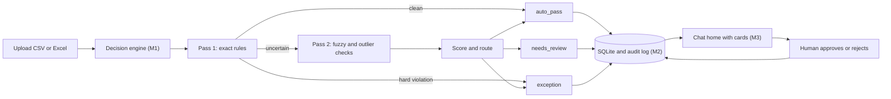
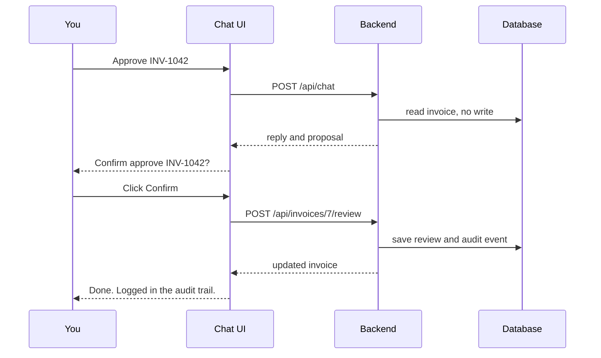

# Cache Me If You Can

A chatbot that works through the accounts-payable exception pile. Upload invoices, ask what needs attention, see why each one was flagged, and approve or reject it from the chat.

Rules decideAI explainsA person confirms

Example conversation with sample data. Try the buttons.

Why was INV-1042 flagged?

INV-1042 looks like a repeat of INV-0987. Same vendor invoice number, amount within 0.2%, one day apart.

INV-1042 Acme Pvt Ltd ₹10,000.00 ! Needs review

Confidence 0.50marks at 0.40 and 0.85

Probable duplicate of INV-0987 (98% similar)

**On this page** [The problem](#problem) [The idea](#idea) [The chatbot](#chat) [Decision engine](#engine) [Report and audit](#report) [Existing tools](#existing) [Stack and scale](#stack) [Team plan](#team) [One look everywhere](#ui) [Demo script](#demo) [Questions and limits](#qa)

## The problem we are solving

A finance team processes thousands of invoices a month. Some of them are wrong: a duplicate, a missing detail, an amount over the limit. Today a person opens each doubtful invoice and digs for the reason. In our test data about 18.4% of invoices are bad, so 184 in every 1,000.

The official challenge, **The Accounts-Payable Exception Pile**, asks for an assistant that checks invoices against rules, flags what is wrong with a short report, and sends only the doubtful rows to a person. We cover each point like this.

| The challenge asks for | What we build |
| --- | --- |
| Check against rules: limits, required fields, duplicates | Eleven rules in the decision engine, R01 to R11 |
| Flag anything wrong with a short report | Chat answers with invoice cards, plus a one-click CSV report |
| Auto-pass the clean ones, send only low-confidence or exception rows to a human | A 0 to 1 confidence score and three outcomes: `auto_pass`, `needs_review`, `exception` |
| Explain each flag by citing the matched record | Every flag carries the rule broken, the exact values and the matched invoice |
| Audit log of every decision | An append-only `audit_log` table and an Audit Log page |
| Theme: smart assistants and chatbots | The chat is the home page and the main way to work the pile |

## The idea in one picture

Think of an airport checkpoint. Clean passengers walk through the fast lane. Suspicious ones are pulled aside, and the officer gets a written note on why. A camera log records every decision. Our system does the same for invoices.

| Who | Does what | Never does |
| --- | --- | --- |
| Rules engine | Decides auto-pass, needs review or exception, with a confidence score and evidence | Guess. Same input always gives the same answer |
| AI (language model) | Writes the plain-English explanation, answers questions, suggests an action | Decide, approve, reject or change data |
| Human reviewer | Confirms approve or reject by clicking a button | Is bypassed. Nothing changes without a click |



### Four layers, one owner each

```
Layer 1  THE BRAIN   decides and scores            engine/    Member 1
Layer 2  THE SPINE   API, database, audit, AI      backend/   Member 2
Layer 3  THE FACE    chat home and screens         frontend/  Member 3
Layer 4  THE PROOF   data, tests, docs, demo       data/ scripts/ tests/ docs/  Member 4
```

## The chatbot is the front door

The home page is a chat. A short summary strip sits above it. The paperclip uploads a file. Answers come back as text plus inline invoice cards, so you can act without leaving the conversation.

### What you can say

| You type | The assistant does | You see |
| --- | --- | --- |
| Attach a file | Runs the engine and stores results | Stats card: how many passed, need review, are exceptions |
| Show the riskiest invoices | Reads pending invoices, lowest confidence first | Up to 5 invoice cards |
| Why was INV-1042 flagged? | Reads the stored decision and evidence | Short answer plus the invoice card with the matched record |
| Show all duplicates | Lists duplicate exceptions | Invoice cards |
| Approve INV-1042 | Only proposes the action | A confirm bar: Confirm approve or Dismiss |
| What happened to INV-1042? | Reads the audit trail | Answer built from real log entries |
| Download the report | Builds a link to the CSV | A download button |

### Why the chat cannot make things up

- **Fixed read-only tools.** The model can only call a short list of functions: `get_invoice`, `explain_decision`, `list_pending`, `list_exceptions`, `list_duplicates`, `get_stats`, `get_audit`, `get_report_link`, `propose_review`. It never writes its own database queries.
- **Cards come from the database.** The backend builds each card from a stored row in code. The model writes only the short sentence around it.
- **A proposal changes nothing.** `propose_review` returns a suggestion. Only the person clicking Confirm calls the real review endpoint, which writes the review and the audit entry.
- **Checked output.** Summaries are validated: valid JSON, at most three sentences, and no invoice ID that is absent from the record.



## The decision engine

This is Member 1's part. It reads a file and returns, for every invoice, one decision, a confidence from 0 to 1, the rules that fired and the evidence. It uses no AI, so the same file always gives the same result.

### Two passes

- **Pass 1** runs on every invoice. It is fast and exact: required fields, amount, dates, calculation, exact duplicate, policy limit, approved vendor.
- **Pass 2** runs only on uncertain invoices. It looks for near-duplicates with fuzzy matching and for amounts far from the vendor's usual.

Pass 1 clears most invoices cheaply, so the slower work touches only a small share.

### The rules

| ID | Fires when | Type | Penalty | Pass |
| --- | --- | --- | --- | --- |
| R01 | A required field is empty | hard | 0.50 | 1 |
| R02 | Total is not a number or is zero or negative | hard | 0.60 | 1 |
| R03 | Invoice date cannot be read | hard | 0.40 | 1 |
| R04 | Invoice date is in the future | soft | 0.30 | 1 |
| R05 | Subtotal plus tax differs from total by more than 0.5% | soft | 0.35 | 1 |
| R06 | Same vendor, invoice number and total as an earlier invoice | hard | 0.80 | 1 |
| R07 | Total is above the policy limit (default ₹100,000) | soft | 0.20 | 1 |
| R08 | Vendor not in the approved list, or category not allowed | soft | 0.20 | 1 |
| R09 | Probable duplicate: similar to an earlier invoice and the invoice numbers are at least 80% alike | soft | 0.35, or 0.20 for a weaker match | 2 |
| R10 | R09 fired and the amount is within 1% of the matched invoice | soft | 0.15 | 2 |
| R11 | Total is more than 3 standard deviations from this vendor's usual | soft | 0.20 | 2 |

A **hard** violation always makes the invoice an exception. A **soft** one only lowers the score.

### Score and routing

```
confidence = max(0, 1 − sum of penalties of the rules that fired)

any hard violation          → exception
confidence ≥ 0.85           → auto_pass
0.40 ≤ confidence < 0.85    → needs_review
confidence < 0.40           → exception
```

The score works like a report card. A bare 0.50 explains nothing, but a list of marks lost explains everything.

### Worked example

New invoice INV-1042 from "Acme Pvt Ltd", ₹10,000, dated 3 Sep. Earlier invoice INV-0987 from "Acme Private Limited", ₹10,020, dated 2 Sep. Both carry the vendor invoice number AC/2026/0345.

1. Pass 1: every field is present, the dates are valid, the maths is right. The names and amounts differ slightly, so it is not an exact duplicate. The invoice is marked **uncertain**.
2. Pass 2: after dropping words like "Pvt", "Private", "Ltd" and "Limited", both vendors read "acme". Name similarity is 1.00, invoice number similarity 1.00, amount similarity 0.998, date similarity 0.86. Weighted together that is about 0.98.
3. R09 fires at 0.35. The amount is within 0.2%, so R10 fires at 0.15.

Start1.00

R09 Probable duplicate−0.35

R10 Near-identical amount−0.15

Confidence0.50

0.50 sits between 0.40 and 0.85, so the result is **needs_review**, type "Probable duplicate", matched record INV-0987.

### How the fuzzy match works

| Ingredient | How it is measured | Weight |
| --- | --- | --- |
| Vendor name | Normalise (lowercase, no punctuation, no "pvt/ltd/private/limited"), then compare with a token similarity ratio | 0.35 |
| Invoice number | Keep letters and digits only, then a character similarity ratio | 0.30 |
| Amount | 1 − \|a − b\| / larger of the two | 0.20 |
| Date | 1 − days apart / 7, never below 0 | 0.15 |

The invoice-number gate matters. Two invoices from the same vendor, a day apart, with similar amounts but different invoice numbers are usually separate bills. Without the gate we would flag every regular supplier.

### Speed

Exact duplicates use a lookup table, so each check is one step. Fuzzy matching compares an invoice only with others within 30 days and within 10% of its amount, instead of with all 1,000.

### Choosing the 0.85 threshold

Member 4 plants known errors in synthetic data and keeps an answer key. We try thresholds from 0.70 to 0.95 on a training file and count two things: bad invoices that slipped through, and good invoices sent to a person for no reason. We pick the value that misses almost nothing with a review load people can handle, then confirm it on a separate test file. The threshold is a setting in the app.

Targets for the test file: at least 95% of bad invoices caught (recall) and at least 80% of flags correct (precision).

## Report and audit log

### The short report

One button downloads a CSV of the flagged invoices. Columns: `invoice_id, invoice_number, vendor_name, invoice_date, total_amount, currency, decision, confidence, exception_type, primary_reason, matched_record, review_status`. Rows are sorted with the lowest confidence first. Text cells that start with `=`, `+`, `-` or `@` get a leading quote so Excel does not run them as formulas.

### The audit log

Every state change writes a row with time, actor, actor type, event, invoice and details. Events: file uploaded, file processed, auto-passed, sent for review, AI summary created, approved by reviewer, rejected by reviewer, settings changed, assistant question. The engine, the AI, the reviewer and the system each appear under their own name, so you can always tell who did what.

## How we compare with existing tools

Dynamics 365 Finance, SAP Concur Invoice and SAP Business ByDesign already catch exceptions, apply tolerances, route approvals and keep audit trails. We do not claim otherwise. Our difference is what happens after the flag.

|  | Dynamics 365 Finance | SAP Concur Invoice | SAP Business ByDesign |
| --- | --- | --- | --- |
| What it is | Large ERP | Spend and invoice product | Cloud ERP for mid-sized firms |
| Exceptions | Invoice capture reads invoices, matches them to purchase orders, lists exceptions and import failures | Compares invoices with purchase orders and receipts and shows exceptions | Fixed exception types: possible duplicate, missing or wrong information, missing receipt, price and quantity variance |
| Confidence | Per-field score on the OCR reading, with admin thresholds | Invoice Capture add-on uses AI and OCR | Tolerance values for price variance |
| Chat assistant | Copilot, with examples mostly on collections | Joule, with examples mostly on expenses | Not confirmed |

| Where we differ | How |
| --- | --- |
| Light and standalone | Upload a file and get results. No ERP setup |
| Flags that explain themselves | Rule broken, exact values, matched record, a score breakdown and a plain-English summary |
| Score on the decision | Existing scores say whether a field was read correctly. Ours says whether the invoice is safe to pay, and shows which rules lowered it |
| Chat built for one job | Explains flags from stored evidence and lets you act through cards |
| AI that never decides | Rules decide. AI explains. A person confirms |

We are a prototype on synthetic data. We do not do full purchase-order and goods-receipt matching, and those products are mature and tested in real companies.

## Tech stack and scale

It is a web app: a React site talking to a Python backend. It is not a browser extension or a mobile app.

| Part | Choice | Why |
| --- | --- | --- |
| Frontend | React 18, Vite, Recharts | Quick to build chat, cards and charts |
| Backend | Python 3.11, FastAPI | Python has the data and AI libraries. FastAPI documents the API automatically |
| Data work | Pandas, rapidfuzz, openpyxl | Reads CSV and Excel. Ready-made fuzzy matching |
| Database | SQLite | No setup, one file. Right for a prototype |
| AI | Azure OpenAI, with a built-in mock mode | Fits a Microsoft hackathon. Mock mode runs offline and powers all tests |

### Scalability, honestly

- The costly steps run only on the uncertain share of invoices.
- Duplicate search avoids comparing every invoice with every other one.
- Rules, weights and thresholds are settings, so each company can adjust them.
- Growth path: SQLite to PostgreSQL, a background queue for very large files, several API servers.

Today it is a single-machine prototype. We claim a design that can scale, not a tested enterprise deployment.

### Will the tuned numbers work on any company's data?

The hard rules do. The weights, thresholds and policy limits are tuned on synthetic data, so they are a starting point. We check them on a file the tuning never saw and on files with 5% and 30% error rates. A real company would re-tune with its own history, and anything uncertain still goes to a person.

## Team plan

| Member | Owns | Folder | Weight |
| --- | --- | --- | --- |
| M1 | Decision engine: ingestion, rules, duplicates, scoring, routing, evidence | `engine/` | Heavy, about 35% |
| M2 | API, database, audit log, AI explanations, chat tools, cards, report | `backend/` | Heavy, about 35% |
| M3 | Chat home, cards, screens and the design system | `frontend/` | Light to medium, about 18% |
| M4 | Repo setup, datasets, answer keys, tests, docs, demo | `data/ scripts/ tests/ docs/` | Light, about 12% |

### How we avoid git conflicts

- Everyone edits only their own folder. Anything else goes through an Issue to the owner.
- One requirements file per package. Only M3 touches Node files. M4 writes `.gitignore` once.
- Everything runs from the repo root, so imports never break.
- A shared contract fixes the names, enums, API, database tables and card shapes. Snake_case everywhere.
- Example JSON files in `contracts/examples/` are the truth, and the frontend mocks copy them.
- Python 3.11 and Node 20. AI runs in mock mode by default, so nobody needs keys.
- Branches: `main` from `develop` from `m1/engine`, `m2/backend`, `m3/frontend`, `m4/data-qa`. Merge by pull request at each gate, in the order M4, M1, M2, M3.

### Gates

| Gate | What must be true |
| --- | --- |
| G0 Scaffold | Repo skeleton, contract, labels and example JSON pushed. All four have run hello-world |
| G1 Foundations | Ingestion and rules R01 to R08. Upload saves to the database. Chat home on mock data. First dataset and answer key |
| G2 Core | Real engine wired in. Review and audit endpoints. Chat with cards on the real API |
| G3 Intelligence | Pass 2, scoring, AI summaries, report, dashboard. Evaluation meets targets |
| G4 Integration | Frontend off mock mode. End-to-end test passes. Bug list closed |
| G5 Freeze | No new features. Demo rehearsed. Merge to `main` |

## One look everywhere

All colours and sizes live in a single file, `tokens.css`. No component uses its own hex code. Status colours mean one thing only.

Primary #0078D4

Navy #11213F

Auto-passed #107C10

Needs review #B35C00

Exception #C42B31

- One font family. Spacing only from the scale 4, 8, 12, 16, 24, 32.
- Badges always show an icon and text, never colour alone.
- The confidence bar is coloured by the decision, with marks at 0.40 and 0.85. A hard-rule exception can still score 0.50.
- Money in the Indian format (₹10,000.00), dates as 03 Sep 2026, invoice IDs in a monospace font.
- Labels come from one table: Auto-passed, Needs review, Exception. The backend, the AI text, the docs and the slides use the same words.
- The invoice card looks identical in the chat, the queue and the detail page.
- Screens: Assistant (home), Review Queue, Invoices, Invoice Detail, Dashboard, Audit Log, Upload, Settings.

## Demo script, about four minutes

1. Problem in 20 seconds: about 18% of invoices become exceptions and people dig through them by hand.
2. Open the chat home. Attach the 1,000-invoice file. A stats card shows about 816 auto-passed and about 184 needing attention.
3. Type "Show the riskiest invoices". Cards appear, lowest confidence first.
4. Type "Why was INV-1042 flagged?". The answer cites INV-0987 and shows both records.
5. Open details: the score breakdown (1.00 down to 0.50), the side-by-side records and the AI explanation.
6. Type "Approve INV-1042". The assistant only proposes. Click Confirm. It says the action is logged.
7. Type "Download the report". A CSV downloads.
8. Show the Audit Log with every step. Close with: rules decide, AI explains, humans confirm.

Keep a screen recording as a backup, and a seeded demo database in case the live upload fails.

## Questions you may get, and limits to admit

| Question | Answer |
| --- | --- |
| Who decides the flags? | The rules engine flags. The AI explains. A person gives the final approve or reject. Every step is logged |
| Why not let AI decide? | It can invent facts and is not repeatable. Money decisions must be exact and explainable |
| Why two passes? | Pass 1 is cheap and clears most invoices. Pass 2 runs only on the uncertain few |
| How did you pick 0.85? | We tested several values on data with known errors and picked the one that misses almost none with a manageable review load. It is configurable |
| How do you measure accuracy? | We compare the engine with the planted-error answer key: precision, recall and F1 |
| Does the chat have a hallucination risk? | It can only call read-only tools. Cards come from the database, and summaries are validated |
| What if two rules conflict? | A hard violation forces an exception. Otherwise the penalties add up |
| Isn't your data fake? | It is synthetic on purpose. We know exactly which errors are inside, so accuracy can be measured |

**Limits to state openly.**

- Synthetic data. The weights and thresholds need re-tuning on real company data.
- No full purchase-order and goods-receipt matching.
- Fuzzy matching can raise false alarms. That is why uncertain cases go to a person.
- Reviewer names are typed in, not verified by a login.
- The score is a risk heuristic, not a true probability.

Cache Me If You Can · Microsoft Innovate 2026 · Built from the shared contract (version 1.1, chat-first) and the four member guides.