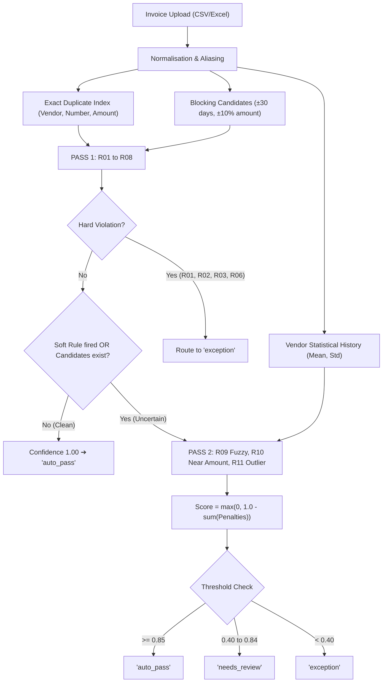

# Cache Me If You Can: Architecture & System Design ⚡

> **Microsoft Innovate Hackathon 2026** — *The Accounts-Payable Exception Pile Assistant*  
> **Theme:** Smart Assistants & Chatbots (Chat-First AP Assistant)

---

## 1. Core Philosophy: The Airport Checkpoint

```
┌─────────────────┐      ┌─────────────────────────┐      ┌─────────────────┐
│  Rules Decide   │ ───► │       AI Explains       │ ───► │ Person Confirms │
│ (Deterministic) │      │ (Grounded & Verifiable) │      │ (Authenticated) │
└─────────────────┘      └─────────────────────────┘      └─────────────────┘
```

Think of an international airport security checkpoint:
1. **The Fast Lane (Rules Decide):** Clean passengers with valid credentials walk through unimpeded (`auto_pass`). The scanner is deterministic: it never guesses or changes its mind based on how a question is asked.
2. **The Referral Note (AI Explains):** Passengers flagged with irregularities are pulled aside. An automated assistant hands the border officer an evidence card detailing exactly which rule failed, which document was matched, and a concise summary. The AI never decides whether to admit or deport the passenger.
3. **The Stamp (Person Confirms):** Only a human officer clicking the approval button changes the traveler's legal status.
4. **The Security Camera (Audit Log):** Every action, scan, flag, explanation, and human confirmation is permanently recorded in an append-only audit trail.

---

## 2. Four-Layer Monorepo Architecture

The system is decoupled into four strictly scoped layers, each owned by a single team member to eliminate merge conflicts and ensure enterprise separation of concerns:

```
┌────────────────────────────────────────────────────────────────────────┐
│  LAYER 3: THE FACE (frontend/)                             [Member 3]  │
│  React 18 + Vite + Design Tokens + Assistant Chat + Review Queue + UI  │
└───────────────────────────────────┬────────────────────────────────────┘
                                    │ REST API (/api/*) + Cards & Proposals
┌───────────────────────────────────▼────────────────────────────────────┐
│  LAYER 2: THE SPINE (backend/)                             [Member 2]  │
│  FastAPI + SQLite DB + Append-Only Audit Log + Azure / Mock LLM Assistant │
└───────────────────────────────────┬────────────────────────────────────┘
                                    │ Python Package Import
┌───────────────────────────────────▼────────────────────────────────────┐
│  LAYER 1: THE BRAIN (engine/)                              [Member 1]  │
│  Deterministic 2-Pass Engine + Rules R01–R11 + Blocking + Confidence    │
└───────────────────────────────────┬────────────────────────────────────┘
                                    │ Ground Truth & Benchmarks
┌───────────────────────────────────▼────────────────────────────────────┐
│  LAYER 4: THE PROOF (data/, scripts/, tests/, docs/)       [Member 4]  │
│  Synthetic Accounting Datasets + Answer Keys + QA Suites + Docs + Demo │
└────────────────────────────────────────────────────────────────────────┘
```

---

## 3. Decision Engine Pipeline (2-Pass Design)



### Why Two Passes?
- **Computational Efficiency:** 81.6% of invoices in normal corporate workflows are clean. Pass 1 checks exact criteria in O(1) time without pairwise fuzzy comparisons.
- **Controlled Uncertainty:** The quadratic string-distance algorithms (`token_set_ratio`, `levenshtein`) and statistical z-score tests only execute on the small, uncertain fraction of records.

---

## 4. Chat-First Assistant & Guardrail Contracts

1. **Read-Only LLM Tools:** The language model cannot execute arbitrary SQL queries or mutate state. It has access exclusively to 9 strictly scoped read-only tools:
   - `get_invoice(invoice_id)`
   - `explain_decision(invoice_id)`
   - `list_pending(limit=5)`
   - `list_exceptions(exception_type, limit=10)`
   - `list_duplicates(limit=10)`
   - `get_stats(upload_id)`
   - `get_audit(invoice_id, limit=10)`
   - `get_report_link(upload_id)`
   - `propose_review(invoice_id, action)`

2. **Server-Generated Cards:** Inline interactive cards (`invoice`, `stats`, `report`) are constructed directly by Python backend services from database rows. The LLM only generates conversational glue text.

3. **Proposals Require Human Confirmation:** The `propose_review` tool only generates an interactive UI proposal card. The database status remains `pending` until the reviewer physically clicks **Confirm Approve** or **Confirm Reject** in the UI, which dispatches a verified `POST /api/invoices/{id}/review`.

---

## 5. Security & Enterprise Auditability

- **Immutable Audit Trail:** Stored in the `audit_log` table with timestamps, actor IDs, actor types (`engine`, `ai`, reviewer name, `system`), event types, and structured JSON payloads.
- **Formula Injection Mitigation:** Any string cell beginning with `=`, `+`, `-`, or `@` exported into CSV reports is automatically sanitized with a leading single quote (`'`) to neutralize Excel DDE injection vectors.
- **Offline Reliability:** Fully functional in `AI_MODE=mock` without active internet access or cloud API keys.
