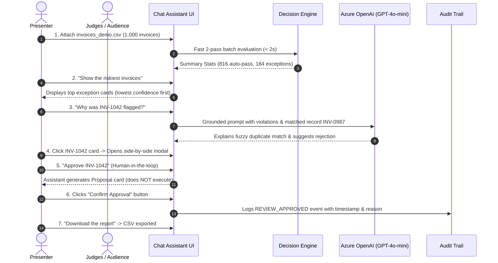

# Hackathon Demo Walkthrough Script (3–4 Minutes)

**Presentation Style:** Chat-First, Live Interactive Demo  
**Target Time:** 3 minutes 30 seconds  
**Presenters:** Team *Cache Me If You Can*  
**Core Thesis:** *"Rules decide, AI explains, humans confirm. Everything is auditable."*

---

## Preparation & Pre-Flight Checklist

- [ ] Backend running: `uvicorn backend.main:app --port 8000`
- [ ] Frontend running: `npm run dev` at `http://localhost:5173`
- [ ] Demo file ready on desktop: `data/processed/invoices_demo.csv`
- [ ] Fallback database ready: If live upload encounters network lag, run `python -m backend.seed` in advance.
- [ ] Backup video recording open in background player.

---

## Step-by-Step Presentation Script

### 1. The Problem Statement (0:00 – 0:20)
> *"Hello everyone! In enterprise finance, up to 18% of invoices end up as exceptions—duplicates, mismatched math, vendor discrepancies, or policy breaches. Accounts Payable teams waste hundreds of hours manually cross-referencing spreadsheets and ERP screens.*  
> *Today, we introduce **Cache Me If You Can**: an intelligent, audit-proof AP Exception Assistant built on a strict operational guarantee: **Rules decide, AI explains, humans confirm.**"*

---

### 2. Live Batch Ingestion (0:20 – 0:50)
> *"Let's see it live. We navigate to our chat assistant and upload a live batch of 1,000 invoices—`invoices_demo.csv`."*  
*(Click paperclip icon, select `invoices_demo.csv`)*  
> *"In under 2 seconds, our deterministic 2-pass engine validates all 1,000 records. A summary card immediately renders in chat: **816 invoices auto-passed** with 100% confidence, and **184 invoices** require human attention."*

---

### 3. Risk-First Chat Exploration (0:50 – 1:20)
> *"Instead of digging through 184 rows in a table, an AP clerk simply chats naturally."*  
*(Type: `Show the riskiest invoices`)*  
> *"The assistant returns the highest-priority exceptions sorted by lowest confidence score first. Notice invoice `INV-1042` with confidence 0.50."*

---

### 4. Grounded AI Explanation (1:20 – 2:00)
> *"Let's ask the assistant to explain why this was flagged."*  
*(Type: `Why was INV-1042 flagged?`)*  
> *"Notice the AI's explanation: It does not guess. It is strictly grounded in the rule engine's evidence. It identifies that `INV-1042` from Acme Pvt Ltd shares the exact invoice number `AC/2026/0345` and an amount within ₹20 of an existing approved invoice: `INV-0987` from Acme Private Limited. It suggests rejecting the duplicate."*

---

### 5. Side-by-Side Inspection & Confidence Breakdown (2:00 – 2:30)
> *"Clicking on `INV-1042` opens the detail modal. Here, the clerk sees:*  
> *1. A mathematical score breakdown showing exactly how the base confidence of 1.00 dropped to 0.50.*  
> *2. A side-by-side comparison between `INV-1042` and `INV-0987` highlighting the name variation and ₹20 difference.*  
> *3. The AI summary and recommended action."*

---

### 6. The Human-in-the-Loop Safe Proposal (2:30 – 2:50)
> *"Now, watch what happens if a user instructs the AI via chat to take action."*  
*(Type: `Approve INV-1042`)*  
> *"The AI **cannot** modify the database or approve invoices autonomously. Instead, it renders an interactive **Proposal Card**. Only an authenticated human clicking the **Confirm** button commits the decision."*  
*(Click `Confirm` button)*  
> *"The assistant responds: 'Action confirmed. Logged in the audit trail.'"*

---

### 7. Export & Audit Trail (2:50 – 3:15)
> *(Type: `Download the report`)*  
> *"A sanitized CSV report of all flagged exceptions downloads instantly with formula-injection protection.*  
> *Finally, we switch to the **Audit Log tab**. Every action—file upload, rule flagging, AI explanation generation, proposal creation, and user confirmation—is recorded chronologically with SHA-256 traceability."*

---

### 8. Conclusion & Pitch (3:15 – 3:30)
> *"To summarize: Existing tools like SAP or Dynamics give either rigid tables or ungrounded generative chatbots. **Cache Me If You Can** marries deterministic rule execution with evidence-grounded AI explanations and strict human-in-the-loop approvals.*  
> *Thank you, and we welcome your questions!"*
