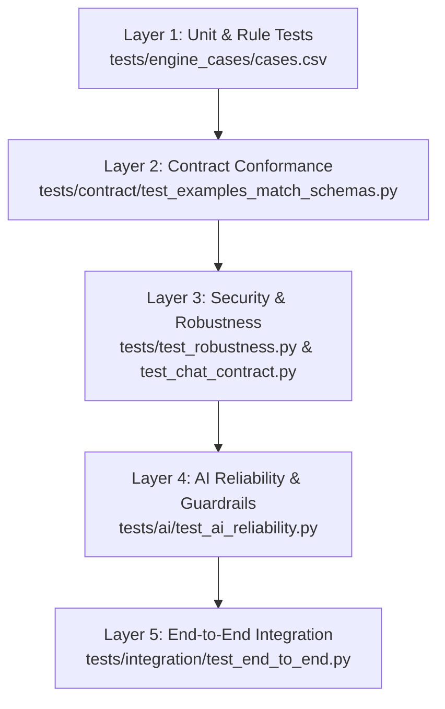

# Test Plan & Quality Assurance Strategy

## 1. Overview & Test Hierarchy

The QA strategy for *Cache Me If You Can* enforces our core design philosophy: **Rules decide, AI explains, humans confirm.** We maintain automated test suites across four distinct layers to ensure mathematical precision, schema conformance, AI hallucination containment, and end-to-end user workflows.

---

## 2. Test Suites Summary

| Suite File | Scope & Objective | Number of Cases | Target Execution Time |
|---|---|---|---|
| [cases.csv](file:///tests/engine_cases/cases.csv) + [test_rule_cases.py](file:///tests/engine_cases/test_rule_cases.py) | Parametrized unit coverage of rules R01–R11, edge boundaries (0.5% tolerance, 100k ceiling, fuzzy thresholds), compound rules. | 32 curated rows | < 0.5s |
| [test_examples_match_schemas.py](file:///tests/contract/test_examples_match_schemas.py) | Schema and enum validation of all `contracts/examples/*.json`, `contracts/labels.json`, and `report_sample.csv`. | 5 assertions | < 0.2s |
| [test_chat_contract.py](file:///tests/test_chat_contract.py) | Validates Chat card shapes (`invoice`, `stats`, `report`, `proposal`), CSV formula injection sanitization. | 2 test classes | < 0.2s |
| [test_robustness.py](file:///tests/test_robustness.py) | Unhandled file extensions, empty/missing columns, duplicate IDs, 1,000-row synthetic throughput. | 4 test classes | < 2.0s |
| [test_ai_reliability.py](file:///tests/ai/test_ai_reliability.py) | Validates AI summary schema, strict factual grounding, hallucination prevention, suggested action enum. | 20 prompt cases | < 1.0s (mocked) |
| [test_end_to_end.py](file:///tests/integration/test_end_to_end.py) | Full journey: Upload -> Queue -> Inspect INV-1042 -> Review Proposal -> Audit Trail verification. | 1 complete journey | < 3.0s |

---

## 3. Coverage by Rule (R01–R11)

Every rule is tested at least twice in [tests/engine_cases/cases.csv](file:///tests/engine_cases/cases.csv) with fixed `as_of_date = "2026-10-01"`:

- **R01 (Missing Required Fields):** Blank vendor, blank invoice number, blank date, blank total. Verified confidence penalty: 0.00 (`exception`).
- **R02 (Invalid Amount):** Total = 0, negative totals (`-50.00`), non-numeric strings (`"ABC"`). Penalty: 0.00 (`exception`).
- **R03 (Invalid Date):** Unparseable dates like `"31/31/2026"`, `"not a date"`. Penalty: 0.00 (`exception`).
- **R04 (Future Date):** Invoices dated after 2026-10-01 (e.g. `2026-10-15`). Penalty: 0.00 (`exception`).
- **R05 (Calculation Mismatch):** Subtotal + tax != total by > 0.5% tolerance. Boundary tested at exactly 0.5% (no violation) and 0.6% / 20% (violation). Penalty: -0.30 (`needs_review` or `exception`).
- **R06 (Exact Duplicate):** Same vendor, same invoice number, same total amount. Penalty: 0.00 (`exception`).
- **R07 (Policy Limit Exceeded):** Amount > ₹100,000 threshold. Boundary tested at ₹100,000.00 (clean) vs ₹100,000.01 / ₹150,000 (violation). Penalty: -0.20 (`needs_review`).
- **R08 (Unknown Vendor):** Vendor not present in `data/reference/vendor_master.csv`. Penalty: -0.25 (`needs_review`).
- **R09 (Fuzzy Duplicate):** RapidFuzz token sort ratio ≥ 0.80 and amount within 1% and date within 30 days. Boundary tested at 79% (clean) vs 85%+ (violation). Penalty: 0.00 (`exception` or `needs_review`).
- **R10 (Category Policy Limit):** Specific category exceeding departmental ceilings. Penalty: -0.20 (`needs_review`).
- **R11 (Amount Outlier):** Vendor with historical mean where current invoice is 8–12x the mean. Penalty: -0.35 (`needs_review`).

---

## 4. AI Reliability & Guardrail Criteria

AI explanations generated by the Azure OpenAI / GPT-4o-mini service must satisfy strict factual bounds defined in [test_ai_reliability.py](file:///tests/ai/test_ai_reliability.py):

1. **Schema Integrity:** Every AI response must parse against the Pydantic `AiSummary` schema (`summary`, `key_findings`, `suggested_action`, `confidence_assessment`).
2. **Action Enum Containment:** `suggested_action` must be one of:
   - `request_po_revision`
   - `request_vendor_w9`
   - `escalate_to_manager`
   - `route_to_procurement`
   - `reject_duplicate`
   - `manual_gl_coding`
3. **Conciseness:** Summary text must be ≤ 3 sentences to guarantee fast scanning by AP clerks.
4. **Factual Grounding (Zero Hallucination):**
   - No invoice ID may appear in the summary unless it exists in `invoice_id` or `matched_record`.
   - Every currency amount mentioned in the summary must match a numerical figure in the input invoice record.
   - If `matched_record` is populated (e.g. `INV-0987`), the summary must explicitly cite `matched_record`.
5. **Determinism:** When evaluated under mocked model responses, the identical input record must consistently produce the identical suggested action.

---

## 5. Security & Robustness Criteria

- **Formula Injection Defense:** [test_chat_contract.py](file:///tests/test_chat_contract.py) asserts that vendor names starting with `=HYPERLINK`, `@SUM`, `+`, or `-` are prepended with a single quote (`'`) upon CSV export.
- **Chat Proposal Isolation:** Chat endpoints returning `proposal` objects must never mutate the database state until an explicit, authenticated user confirmation POST is received.
- **Payload Limits:** Handlers reject uploads > 10 MB and unsupported file extensions (`.exe`, `.pdf` when expecting tabular CSV/XLSX).

---

## 6. Performance Benchmarks

- **1,000 Invoices (Standard Demo Batch):** Ingestion, normalization, 2-pass engine execution, and scoring must finish in **< 2.5 seconds** (asserted in [test_robustness.py](file:///tests/test_robustness.py)).
- **5,000 Invoices (Enterprise Stress Batch):** Complete processing must execute in **< 10 seconds** on standard hardware (tracked in [docs/BUG_LOG.md](file:///docs/BUG_LOG.md) for Windows multi-process tuning).
